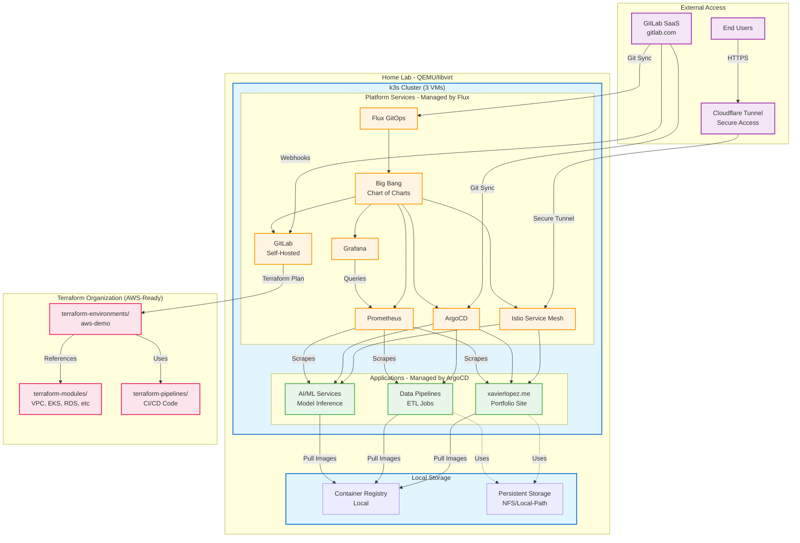
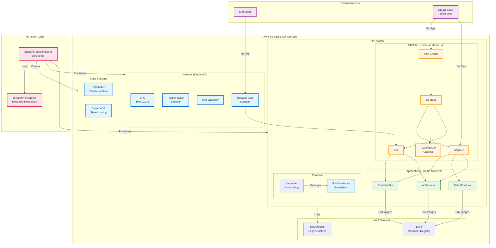
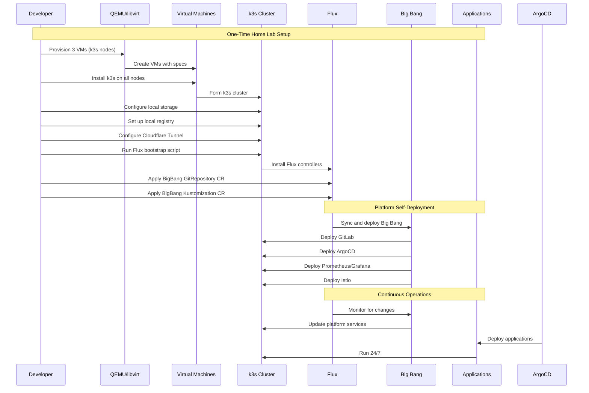
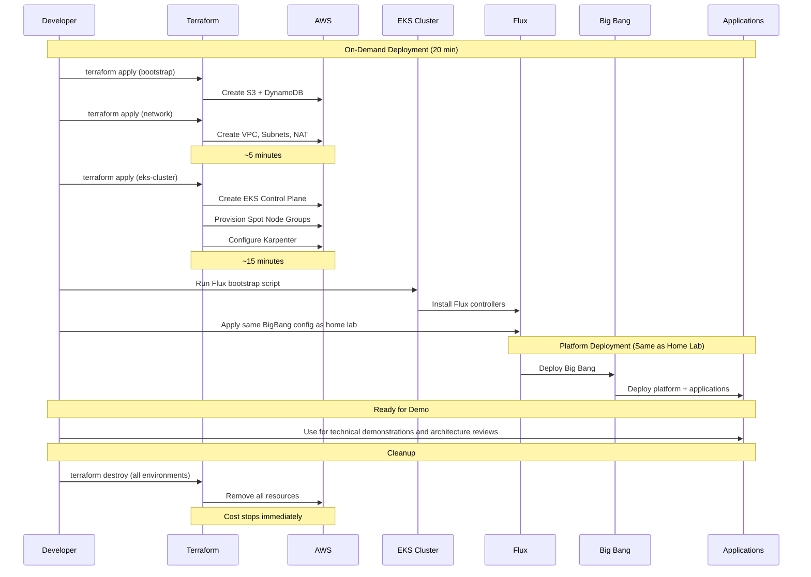
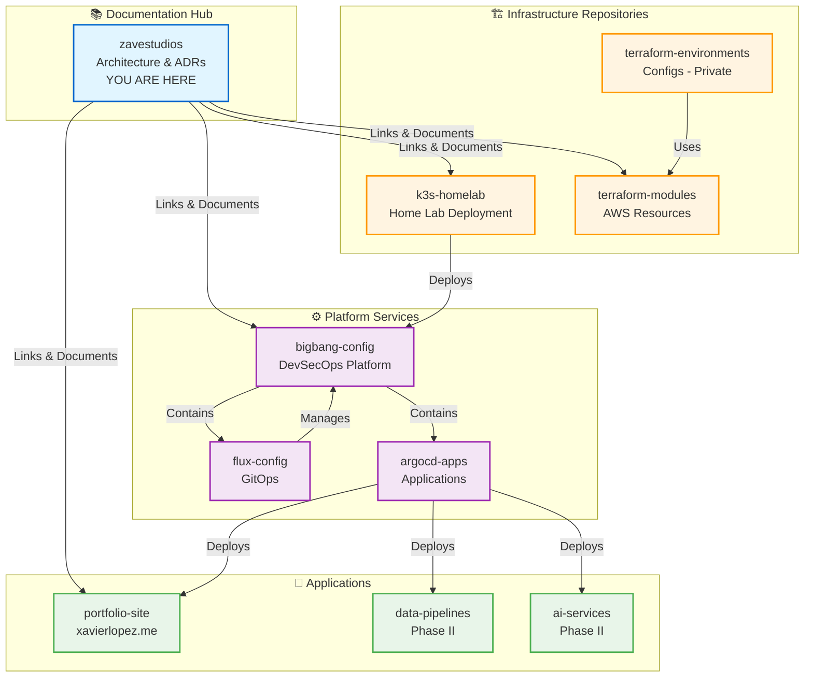

# ZaveStudios Portfolio and Reference Platform

> **Note:** This repository is the **architectural documentation hub**. It contains design decisions, ADRs, and system architecture. The actual infrastructure code lives in separate implementation repositories - see [Repository Organization](#repository-organization) below.

**Status:** Phase I - Foundation & Bootstrap  
**Completion:** ~15% (Documentation complete, infrastructure in progress)  
**Timeline:** Phase I target Q1 2026, Phase II target Q2 2026  
**Current Focus:** Home lab k3s deployment with [Big Bang](https://repo1.dso.mil/big-bang) DevSecOps baseline

## Purpose

ZaveStudios is not a static portfolio project—it's a living platform that runs 24/7/365, performing real work and evolving continuously. The platform demonstrates hybrid cloud architecture: **production operations run on a home lab k3s cluster at zero cost**, while **AWS-ready Terraform infrastructure** enables on-demand cloud deployment for interested observers.

**Primary Objectives:**
- Demonstrate Senior Platform Engineer/Architect capabilities to interested observers.
- Provide tangible evidence of architectural decision-making, cost optimization, and security architecture
- Prove infrastructure portability through multi-environment support (home lab + AWS)
- Enable rapid prototyping and integration of new technologies and patterns
- Deliver quantifiable business value through cost efficiency and operational excellence

**Architecture Philosophy:** Cloud-ready, not cloud-dependent. Built for portability, optimized for cost.

See [ADR-004: Hybrid Home Lab + AWS Architecture](docs/adrs/004-hybrid-home-lab-aws-architecture.md) for the complete rationale.

## Architecture Overview

### Multi-Environment Strategy

ZaveStudios runs in two environments with complete parity:

**Home Lab (Primary - Always Running):**
- Production operations at zero cost
- Daily development and testing
- 24/7 application availability
- Continuous learning and experimentation

**AWS (On-Demand - Demonstrations):**
- Deploy for interested observers
- Validate cloud-native patterns
- Prove AWS architecture skills
- ~$10-20 per weekend deployment

### Technology Stack

**Primary Platform (Home Lab):**
- **Infrastructure:** k3s cluster on QEMU/libvirt (3 VMs)
- **Platform Foundation:** Big Bang (DoD DevSecOps reference architecture)
- **GitOps:** Flux (platform services) + ArgoCD (application workloads)
- **CI/CD:** Self-hosted GitLab with automated Terraform pipelines
- **Observability:** Prometheus/Grafana (self-hosted)
- **Networking:** Cloudflare Tunnel (secure external access, no port forwarding)
- **Storage:** Local storage provisioner / NFS

**AWS Deployment (On-Demand):**
- **Infrastructure:** EKS (us-east-1, single-AZ, spot instances with Karpenter)
- **IaC:** Complete Terraform codebase (modules + environments)
- **Services:** ECR, CloudWatch, VPC endpoints
- **Same Manifests:** Applications deploy identically in both environments

### Key Design Principles

- **Infrastructure Portability** - Same GitOps workflows and manifests work in home lab and AWS
- **Cost Discipline** - $0/month operations (saves $150-200 monthly vs. AWS 24/7)
- **Cloud-Ready Architecture** - Can deploy to AWS in ~20 minutes for demonstrations
- **Production-Grade Operations** - Real workloads, monitoring, GitOps, 24/7 uptime targets
- **Hybrid Cloud Thinking** - Demonstrates multi-environment patterns common in enterprises
- **GitOps Native** - All changes via Git, complete audit trail
- **Separation of Concerns** - Clear boundaries between infrastructure, platform, and applications

## High-Level System Architecture

### Production Environment (Home Lab)

### Description - Home Lab Architecture

**Cost:** $0/month

**Key Features:**
- Runs 24/7 on existing home lab hardware
- Cloudflare Tunnel provides secure external access (no port forwarding)
- Self-hosted GitLab for CI/CD automation
- Complete platform services via Big Bang
- Local container registry for image storage
- Same GitOps workflows as cloud deployment
---

## AWS On-Demand Deployment

### Description - AWS Deployment

**Cost:** ~$10-20 per weekend deployment

**Deployment Time:** ~20 minutes from `terraform apply` to operational platform

**Use Cases:**
- Technical demonstrations and architecture reviews
- AWS skill validation
- Cloud-native pattern testing
- Certification practice (AWS SA Pro)

**Lifecycle:**
- **Deploy:** Friday evening
- **Demo/Test:** Saturday
- **Destroy:** Sunday afternoon
- **Cost stops:** Immediately after destroy

**Key Features:**
- Identical platform services as home lab
- Same application manifests
- Spot instances + Karpenter for cost optimization
- Single-AZ deployment (cost vs availability trade-off)
- Complete Infrastructure as Code

---
### Architecture Layers

#### Infrastructure Layer
AWS foundational resources managed by Terraform:
- VPC and networking components
- EKS cluster and node groups
- State management (S3/DynamoDB)
- Load balancers and gateways

#### Platform Layer
Core platform services deployed via Big Bang and managed by Flux:
- GitOps controllers (Flux, ArgoCD)
- CI/CD infrastructure (GitLab)
- Observability stack (Prometheus/Grafana)
- Service mesh (Istio)

#### Application Layer
User-facing workloads managed by ArgoCD:
- Web applications and APIs
- Data engineering pipelines
- AI/ML services

#### External Dependencies
Services outside the AWS account:
- GitLab SaaS (git repository hosting)
- End users accessing applications
- DNS management

#### Terraform Organization
Infrastructure as Code structure:
- Reusable modules for AWS resources
- Environment-specific configurations
- Shared pipeline code

## Diagram 3: Bootstrap Sequence (Home Lab)

---

## Diagram 4: Bootstrap Sequence (AWS On-Demand)

### Deployment Phases

**Phase 1: Manual Bootstrap** (One-time setup)
1. Create Terraform state backend (S3 + DynamoDB)
2. Provision networking infrastructure (VPC, subnets, NAT gateway)
3. Deploy EKS cluster with node groups
4. Install Flux GitOps controllers
5. Configure Flux to sync Big Bang repository

**Phase 2: Platform Self-Deployment** (Automated via Flux)

6. Flux deploys Big Bang helm chart
7. Big Bang deploys all platform services (GitLab, ArgoCD, observability, service mesh)

**Phase 3: Self-Managing Infrastructure** (GitLab CI/CD)

8. All infrastructure changes flow through GitLab pipelines
9. Feature branches: `tfsec` + `terraform plan`
10. Main branch: `tfsec` + `terraform plan` + `terraform apply`

## Platform Evolution Roadmap

### Phase I: Foundation & Bootstrap (Q1 2026)
**Status:** In Progress (~15% complete)

Core infrastructure deployment:
- AWS EKS cluster with Big Bang DevSecOps baseline
- GitOps automation (Flux + ArgoCD)
- Self-hosted CI/CD (GitLab)
- Observability stack (Prometheus/Grafana)
- Architecture designed for multi-tenancy and revenue workloads

### Phase II: Data & AI Platform (Q2 2026)
**Status:** Planning

Data engineering and AI capabilities:
- **Data Pipeline Infrastructure**
  - Workflow orchestration (Airflow or Prefect)
  - ETL/ELT processing capabilities
  - Data quality and observability
- **AI/ML Workloads**
  - Self-hosted LLM deployment (Ollama, LocalAI, or vLLM)
  - Model serving and inference APIs
  - GPU scheduling and cost optimization
  - Vector databases for RAG systems

### Phase III: Scale & Optimization (Q3+ 2026)
**Status:** Future

Production scaling and business model refinement:
- Advanced AI workloads and fine-tuned models
- Cost optimization at scale

## Cost Model

### Home Lab Operations (Primary Platform)

**Monthly Cost: $0**

- Infrastructure: Existing QEMU/libvirt hardware (no incremental cost)
- Electricity: ~$10-20/month (absorbed in existing home lab operations)
- Internet: No additional bandwidth cost
- **Net incremental cost: $0/month**

**What's Included:**
- 24/7 k3s cluster operations
- All platform services (GitLab, ArgoCD, Prometheus, Grafana, Istio)
- Application hosting (portfolio sites, data pipelines, AI services)
- Continuous integration and deployment
- Full observability and monitoring

### AWS On-Demand Deployments

**Per-Deployment Cost: $10-20**

Typical deployment pattern:
- Deploy: Friday evening (~20 minutes)
- Demo/Test: Saturday (full day available)
- Destroy: Sunday afternoon
- Duration: ~36-48 hours

**Cost Breakdown (weekend deployment):**
- EKS control plane: ~$3 (36 hours × $0.10/hour)
- EC2 spot instances: ~$2-3 (t3a.medium spot pricing)
- NAT Gateway: ~$1.50
- Network Load Balancer: ~$0.75
- Data transfer: ~$1-2
- S3/DynamoDB: <$0.50
- **Total: ~$10-20 per deployment**

### Cost Optimization Strategies

**Home Lab Advantages:**
- Zero cloud provider costs
- No surprise bills or cost overruns
- Unlimited experimentation within hardware limits
- Learning without financial pressure

**AWS Deployment Efficiency:**
- Spot instances (70-90% savings vs on-demand)
- Single-AZ deployment (eliminates cross-AZ transfer costs)
- Automated destroy procedures (no forgotten resources)
- Infrastructure as Code (reproducible deployments)
- Karpenter autoscaling (right-sized compute)

**Financial Discipline Demonstrated:**
- FinOps thinking from day one
- Cost-conscious architecture decisions
- Resource optimization strategies
- Can scale to production AWS when budget allows

See [ADR-004](docs/adrs/004-hybrid-home-lab-aws-architecture.md) for detailed cost analysis and decision rationale.

## Repository Organization

**ZaveStudios is the architectural documentation hub** - it contains design decisions, architecture documentation, and ADRs. The actual infrastructure code and applications live in separate, focused repositories.

### Why Separate Repositories?

- **Reusability** - Each repo is a standalone tool others can use
- **Clean History** - Focused git history per component
- **Portfolio Value** - Multiple repos demonstrate breadth of skills
- **Clear Boundaries** - Infrastructure vs platform vs applications

### Implementation Repositories

**Infrastructure:**
- **[k3s-homelab](https://github.com/eckslopez/k3s-homelab)** - Home lab k3s cluster deployment (Packer + Terraform libvirt)
- **terraform-modules** *(coming soon)* - Reusable AWS infrastructure modules (VPC, EKS, RDS, etc.)
- **terraform-environments** *(private GitLab)* - Environment-specific configs (aws-demo, production)
- **terraform-pipelines** *(private GitLab)* - CI/CD pipeline code for infrastructure automation

**Platform Services:**
- **bigbang-config** *(coming soon)* - Big Bang platform customization and configuration
- **flux-config** *(coming soon)* - Flux GitOps repository structures and Kustomizations
- **argocd-apps** *(coming soon)* - ArgoCD Application manifests

**Applications:**
- **portfolio-site** *(coming soon)* - xavierlopez.me source code and deployment
- **data-pipelines** *(Phase II)* - Data engineering workloads and ETL jobs
- **ai-services** *(Phase II)* - AI/ML model serving and inference APIs

### How They Connect

**For technical leadership:** Start here to understand architectural thinking, then explore implementation repos to see execution.

**For engineers:** Use individual repos directly for specific tools (e.g., k3s-homelab for home lab setup).

## Documentation

- #TODO [Architecture Overview](docs/architecture/overview.md) - Detailed system architecture
- #TODO [Component Details](docs/architecture/component-details.md) - Deep dives on each component
- #TODO [Bootstrap Guide](docs/architecture/bootstrap-sequence.md) - Step-by-step deployment process
- #TODO [Cost Analysis](docs/architecture/cost-model.md) - Budget breakdown and optimization strategies
- #TODO [Architecture Decision Records](docs/adrs/) - Key architectural decisions with rationale

## Key Design Decisions

### EKS Over Self-Managed Kubernetes
- **Decision:** Use AWS EKS instead of self-managed k3s
- **Rationale:** Demonstrates AWS-native architecture skills, managed control plane reduces operational burden
- **Trade-offs:** Higher baseline cost (~$73/month) vs. self-managed, but better aligned with enterprise patterns
- **ADR:** [001-eks-over-self-managed.md](docs/adrs/001-eks-over-self-managed.md)

### Single-AZ Deployment
- **Decision:** Deploy all resources in single availability zone (us-east-1a)
- **Rationale:** Significant cost savings on cross-AZ data transfer, acceptable risk for portfolio showcase
- **Trade-offs:** Reduced resilience vs. cost optimization, demonstrates financial discipline
- **ADR:** [002-single-az-deployment.md](docs/adrs/002-single-az-deployment.md)

### Flux + ArgoCD Separation
- **Decision:** Use Flux for platform services, ArgoCD for application workloads
- **Rationale:** Separation of concerns, demonstrates expertise with both tools
- **Trade-offs:** Added complexity vs. clear operational boundaries
- **ADR:** [003-flux-and-argocd-separation.md](docs/adrs/003-flux-and-argocd-separation.md)

### Hybrid Home Lab + AWS Architecture
- **Decision:** Run primary platform on home lab k3s, maintain AWS-ready Terraform
- **Rationale:** Zero-cost operations, AWS skills demonstrated via IaC, infrastructure portability
- **Trade-offs:** No live AWS operations vs. $600-1200 savings, stronger hybrid cloud story
- **ADR:** [004-hybrid-home-lab-aws-architecture.md](docs/adrs/004-hybrid-home-lab-aws-architecture.md)

## Technology Choices

### Why Big Bang?
- DoD-proven DevSecOps reference architecture
- Helm chart of charts pattern for managing complex platforms
- Built-in security controls and compliance frameworks
- Extensive package ecosystem (GitLab, ArgoCD, Istio, monitoring, etc.)

### Why Terraform?
- Industry-standard Infrastructure as Code
- Mature AWS provider with comprehensive resource coverage
- State management enables team collaboration
- Module pattern promotes reusability

### Why GitOps?
- Declarative infrastructure and application management
- Complete audit trail via Git history
- Easy rollback and disaster recovery
- Prevents configuration drift

## Success Metrics

### Platform Reliability
- Uptime: >99% (excluding planned maintenance)
- Mean Time to Recovery (MTTR): <30 minutes
- Automated deployments: 100% via GitOps

### Cost Efficiency
- **Home lab operations:** $0/month ongoing
- **AWS on-demand demos:** <$20 per deployment
- **Infrastructure utilization:** >70% during active hours
- **Can demonstrate cloud skills without cloud costs**

### Operational Excellence
- Deployment frequency: Multiple times per week
- Lead time for changes: <1 hour (infrastructure), <15 minutes (applications)
- Change failure rate: <5%

### Portfolio Impact
- Technical demonstrations scheduled: Tracked
- Architecture discussions: Documented
- Peer feedback: Collected and incorporated

## Hybrid Cloud Strategy

### Why Home Lab + AWS?

**Technical Benefits:**
- Proves infrastructure portability (not cloud-locked)
- Demonstrates hybrid cloud patterns (common in enterprises)
- Forces environment-agnostic design
- Tests true Infrastructure as Code

**Showcase Story:**
> "I designed ZaveStudios to run anywhere. Daily, it runs on my home lab at zero cost. But I architected everything with Terraform so I can deploy to AWS EKS for demonstrations. Want to see? I can spin it up right now - takes about 20 minutes. Then I'll destroy it after to avoid unnecessary spend. That's exactly how I approach platform engineering: develop locally, deploy to cloud when needed."

### Environment Parity

**What's the Same:**
- GitOps workflows (Flux + ArgoCD)
- Platform services (Big Bang packages)
- Application manifests
- Monitoring and observability
- CI/CD pipelines

**What's Different:**
- k3s vs EKS control plane
- Local storage vs EBS
- NodePort vs LoadBalancer services
- Local registry vs ECR
- Cloudflare Tunnel vs AWS NLB

**Deployment Time:**
- Home lab: Runs continuously
- AWS: ~20 minutes to full operational platform

See [ADR-004](docs/adrs/004-hybrid-home-lab-aws-architecture.md) for complete rationale and implementation details.

## Contributing

This is a personal portfolio project, but feedback and suggestions are welcome! Feel free to:
- Open issues for questions or suggestions
- Suggest improvements to architecture or documentation
- Share ideas for new capabilities or demonstrations

## License

This project is licensed under the MIT License - see the [LICENSE](LICENSE) file for details.

## Links

- **Portfolio:** [xavierlopez.me](https://xavierlopez.me)
- **LinkedIn:** [linkedin.com/in/zavelopez](https://linkedin.com/in/zavelopez)
- **GitHub:** [github.com/eckslopez](https://github.com/eckslopez)
- **GitLab:** [gitlab.com/platformystical](https://gitlab.com/platformystical)

## Objective Statement

ZaveStudios follows an internal operating objective focused on architectural judgment, leverage, and restraint.

---

**Last Updated:** January 19, 2026
**Status:** Architecture design phase - Implementation in progress
