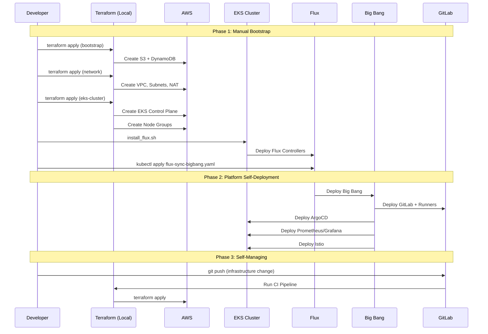

# ZaveStudios Platform Architecture

**A live, continuously operating platform engineering showcase demonstrating production-grade cloud-native architecture, infrastructure automation, and platform engineering capabilities.**

[](https://opensource.org/licenses/MIT)

## 🎯 Purpose

ZaveStudios is not a static portfolio project—it's a living platform that runs 24/7/365, performing real work and evolving continuously. This repository documents the architecture, design decisions, and implementation details of the entire platform.

**Primary Objectives:**
- Demonstrate Senior Platform Engineer/Architect capabilities to technical leadership and collaborators
- Provide tangible evidence of architectural decision-making, cost optimization, and security architecture
- Enable rapid prototyping and integration of new technologies and patterns
- Deliver quantifiable business value through cost efficiency and operational excellence

## 🏗️ Architecture Overview

### Technology Stack

- **Infrastructure:** AWS EKS (us-east-1, single-AZ, cost-optimized with spot instances)
- **Platform Foundation:** Big Bang (DoD DevSecOps reference architecture)
- **GitOps:** Flux (platform services) + ArgoCD (application workloads)
- **CI/CD:** Self-hosted GitLab with automated Terraform pipelines
- **IaC:** Terraform (reusable modules + environment overlays)
- **Observability:** Prometheus/Grafana (self-hosted) + AWS CloudWatch

### Key Design Principles

- **Cost Discipline as Feature** - Operating within ~$150-200/month AWS budget demonstrates FinOps expertise
- **Production-Grade Thinking** - Real workloads, real automation, real operational concerns
- **GitOps Native** - All changes via Git, full audit trail, infrastructure as code
- **Separation of Concerns** - Clear boundaries between infrastructure, platform, and applications
- **Composability** - New capabilities can be added without disrupting existing showcase components

## 📊 High-Level System Architecture

```mermaid
graph TB
    subgraph "External Services"
        GitLab[GitLab SaaS<br/>gitlab.com]
        DNS[Route53/DNS]
        Users[End Users]
    end

    subgraph "AWS Account - us-east-1"
        subgraph "State Management"
            S3[S3 Bucket<br/>Terraform State]
            DynamoDB[DynamoDB<br/>State Locking]
        end

        subgraph "Network Infrastructure"
            VPC[VPC]
            Subnets[Subnets<br/>Single AZ]
            NAT[NAT Gateway]
            NLB[Network Load Balancer]
        end

        subgraph "EKS Cluster"
            subgraph "Platform Layer - Managed by Flux"
                Flux[Flux GitOps<br/>Platform Services]
                BigBang[Big Bang<br/>Helm Chart of Charts]
                GitLabRunner[GitLab<br/>Self-Hosted CI/CD]
                ArgoCD[ArgoCD<br/>App Deployments]
                Prometheus[Prometheus]
                Grafana[Grafana]
                Istio[Istio Service Mesh]
            end

            subgraph "Application Layer - Managed by ArgoCD"
                WebApps[Web Applications<br/>xavierlopez.me, etc]
                DataPipelines[Data Engineering<br/>Pipelines & Jobs]
                AIServices[AI Services<br/>ML Model Serving]
            end

            subgraph "Compute"
                SpotNodes[Spot Instances<br/>t3a.medium]
                Karpenter[Karpenter<br/>Autoscaling]
            end
        end

        subgraph "AWS Services"
            ECR[ECR<br/>Container Registry]
            CloudWatch[CloudWatch<br/>Logs & Metrics]
            RDS[RDS<br/>Databases - Optional]
            Lambda[Lambda<br/>Serverless Functions]
        end
    end

    subgraph "Terraform Organization"
        TFModules[terraform-modules/<br/>Reusable AWS Resources]
        TFEnvs[terraform-environments/<br/>Network, EKS, etc]
        TFPipelines[terraform-pipelines/<br/>Shared CI/CD Code]
    end

    %% Relationships
    Users -->|HTTPS| NLB
    NLB --> Istio
    Istio --> WebApps
    Istio --> AIServices
    
    GitLab -->|Git Sync| Flux
    GitLab -->|Git Sync| ArgoCD
    GitLab -->|Webhooks| GitLabRunner
    
    Flux --> BigBang
    BigBang --> GitLabRunner
    BigBang --> ArgoCD
    BigBang --> Prometheus
    BigBang --> Grafana
    BigBang --> Istio
    
    ArgoCD --> WebApps
    ArgoCD --> DataPipelines
    ArgoCD --> AIServices
    
    GitLabRunner -->|Terraform Apply| TFEnvs
    TFEnvs -->|Uses Modules| TFModules
    TFEnvs -->|References| TFPipelines
    TFEnvs -->|Provisions| VPC
    TFEnvs -->|Provisions| EKS Cluster
    TFEnvs -->|State Backend| S3
    TFEnvs -->|State Locking| DynamoDB
    
    Karpenter -->|Manages| SpotNodes
    
    Prometheus -->|Scrapes| WebApps
    Prometheus -->|Scrapes| DataPipelines
    Prometheus -->|Scrapes| AIServices
    Grafana -->|Queries| Prometheus
    
    WebApps -->|Pulls Images| ECR
    DataPipelines -->|Pulls Images| ECR
    AIServices -->|Pulls Images| ECR
    
    EKS Cluster -->|Logs| CloudWatch

    classDef infrastructure fill:#e1f5ff,stroke:#0066cc,stroke-width:2px
    classDef platform fill:#fff4e1,stroke:#ff9900,stroke-width:2px
    classDef applications fill:#e8f5e9,stroke:#4caf50,stroke-width:2px
    classDef external fill:#f3e5f5,stroke:#9c27b0,stroke-width:2px
    classDef terraform fill:#fce4ec,stroke:#e91e63,stroke-width:2px
    
    class VPC,Subnets,NAT,NLB,S3,DynamoDB infrastructure
    class Flux,BigBang,GitLabRunner,ArgoCD,Prometheus,Grafana,Istio platform
    class WebApps,DataPipelines,AIServices applications
    class GitLab,DNS,Users external
    class TFModules,TFEnvs,TFPipelines terraform
```

### Architecture Layers

#### 🔵 Infrastructure Layer
AWS foundational resources managed by Terraform:
- VPC and networking components
- EKS cluster and node groups
- State management (S3/DynamoDB)
- Load balancers and gateways

#### 🟡 Platform Layer
Core platform services deployed via Big Bang and managed by Flux:
- GitOps controllers (Flux, ArgoCD)
- CI/CD infrastructure (GitLab)
- Observability stack (Prometheus/Grafana)
- Service mesh (Istio)

#### 🟢 Application Layer
User-facing workloads managed by ArgoCD:
- Web applications and APIs
- Data engineering pipelines
- AI/ML services

#### 🟣 External Dependencies
Services outside the AWS account:
- GitLab SaaS (git repository hosting)
- End users accessing applications
- DNS management

#### 🔴 Terraform Organization
Infrastructure as Code structure:
- Reusable modules for AWS resources
- Environment-specific configurations
- Shared pipeline code

## 🚀 Bootstrap Sequence



### Deployment Phases

**Phase 1: Manual Bootstrap** (One-time setup)
1. Create Terraform state backend (S3 + DynamoDB)
2. Provision networking infrastructure (VPC, subnets, NAT gateway)
3. Deploy EKS cluster with node groups
4. Install Flux GitOps controllers
5. Configure Flux to sync Big Bang repository

**Phase 2: Platform Self-Deployment** (Automated via Flux)
6. Flux deploys Big Bang helm chart
7. Big Bang deploys all platform services (GitLab, ArgoCD, observability, service mesh)

**Phase 3: Self-Managing Infrastructure** (GitLab CI/CD)
8. All infrastructure changes flow through GitLab pipelines
9. Feature branches: `tfsec` + `terraform plan`
10. Main branch: `tfsec` + `terraform plan` + `terraform apply`

## 💰 Cost Model

**Target Monthly Budget: $150-200**

### Fixed Costs
- EKS Control Plane: ~$73/month
- NAT Gateway: ~$32/month
- Network Load Balancer: ~$16/month

### Variable Costs (Optimized)
- Compute (spot instances): ~$20-40/month
- Storage (EBS): ~$10-15/month
- Data transfer: ~$5-10/month
- S3/DynamoDB: <$5/month

### Optimization Strategies
- **Spot instances with Karpenter** - 70-90% cost reduction on compute
- **Single AZ deployment** - Eliminates cross-AZ data transfer costs
- **Aggressive autoscaling** - Scale to minimum during low activity
- **Shared resources** - Single NLB for all ingress traffic
- **Self-hosted observability** - Avoid managed Prometheus/Grafana costs

## 📁 Repository Organization

### GitHub Repositories
- **[zavestudios](https://github.com/eckslopez/zavestudios)** (this repo) - Architecture documentation and design decisions
- **terraform-modules** - Reusable Terraform modules for AWS resources
- **application-repos** - Web applications and demonstration projects

### GitLab Repositories
- **bigbang** - Big Bang platform configuration and customization
- **terraform-environments** - Environment-specific infrastructure configurations
- **terraform-pipelines** - Shared CI/CD pipeline definitions
- **operational-repos** - Private operational configurations

## 📚 Documentation

- [Architecture Overview](docs/architecture/overview.md) - Detailed system architecture
- [Component Details](docs/architecture/component-details.md) - Deep dives on each component
- [Bootstrap Guide](docs/architecture/bootstrap-sequence.md) - Step-by-step deployment process
- [Cost Analysis](docs/architecture/cost-model.md) - Budget breakdown and optimization strategies
- [Architecture Decision Records](docs/adrs/) - Key architectural decisions with rationale

## 🔑 Key Design Decisions

### EKS Over Self-Managed Kubernetes
- **Decision:** Use AWS EKS instead of self-managed k3s
- **Rationale:** Demonstrates AWS-native architecture skills, managed control plane reduces operational burden
- **Trade-offs:** Higher baseline cost (~$73/month) vs. self-managed, but better aligned with enterprise patterns
- **ADR:** [001-eks-over-self-managed.md](docs/adrs/001-eks-over-self-managed.md)

### Single-AZ Deployment
- **Decision:** Deploy all resources in single availability zone (us-east-1a)
- **Rationale:** Significant cost savings on cross-AZ data transfer, acceptable risk for portfolio showcase
- **Trade-offs:** Reduced resilience vs. cost optimization, demonstrates financial discipline
- **ADR:** [002-single-az-deployment.md](docs/adrs/002-single-az-deployment.md)

### Flux + ArgoCD Separation
- **Decision:** Use Flux for platform services, ArgoCD for application workloads
- **Rationale:** Separation of concerns, demonstrates expertise with both tools
- **Trade-offs:** Added complexity vs. clear operational boundaries
- **ADR:** [003-flux-and-argocd-separation.md](docs/adrs/003-flux-and-argocd-separation.md)

## 🛠️ Technology Choices

### Why Big Bang?
- DoD-proven DevSecOps reference architecture
- Helm chart of charts pattern for managing complex platforms
- Built-in security controls and compliance frameworks
- Extensive package ecosystem (GitLab, ArgoCD, Istio, monitoring, etc.)

### Why Terraform?
- Industry-standard Infrastructure as Code
- Mature AWS provider with comprehensive resource coverage
- State management enables team collaboration
- Module pattern promotes reusability

### Why GitOps?
- Declarative infrastructure and application management
- Complete audit trail via Git history
- Easy rollback and disaster recovery
- Prevents configuration drift

## 🎯 Success Metrics

### Platform Reliability
- Uptime: >99% (excluding planned maintenance)
- Mean Time to Recovery (MTTR): <30 minutes
- Automated deployments: 100% via GitOps

### Cost Efficiency
- Monthly AWS spend: <$200
- Cost per application deployed: Tracked and optimized
- Infrastructure utilization: >70% during active hours

### Operational Excellence
- Deployment frequency: Multiple times per week
- Lead time for changes: <1 hour (infrastructure), <15 minutes (applications)
- Change failure rate: <5%

### Portfolio Impact
- Technical interviews scheduled: Tracked
- Architecture discussions: Documented
- Peer feedback: Collected and incorporated

## 🤝 Contributing

This is a personal portfolio project, but feedback and suggestions are welcome! Feel free to:
- Open issues for questions or suggestions
- Suggest improvements to architecture or documentation
- Share ideas for new capabilities or demonstrations

## 📄 License

This project is licensed under the MIT License - see the [LICENSE](LICENSE) file for details.

## 🔗 Links

- **Portfolio:** [xavierlopez.me](https://xavierlopez.me)
- **LinkedIn:** [linkedin.com/in/zavelopez](https://linkedin.com/in/zavelopez)
- **GitHub:** [github.com/eckslopez](https://github.com/eckslopez)
- **GitLab:** [gitlab.com/platformystical](https://gitlab.com/platformystical)

---

**Last Updated:** December 31, 2024  
**Status:** Architecture design phase - Implementation in progress
