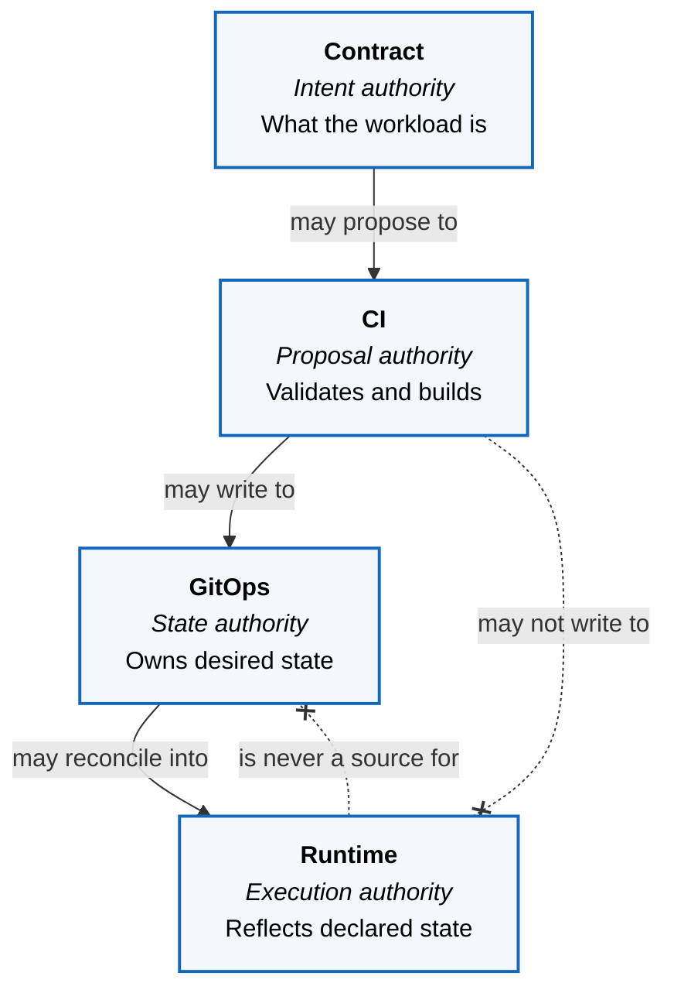

ZaveStudios is built around a baseline path: workloads declare intent, and the platform supplies continuous integration, secure delivery, shared capabilities, and runtime mechanics.

The architecture brings DevSecOps, secure data engineering, data pipelines, and operational AI into one governed shape. Shared platform services provide delivery, data-service integration, observability, policy, and model access through consistent interfaces.

## System Context

Who touches the platform, and what it depends on.

```mermaid
flowchart TB
  dev@{ shape: person, label: "Tenant Developer" }
  op@{ shape: person, label: "Platform Operator" }
  agent["<b>Coding Agents</b><br/><i>[External system]</i><br/>Propose change as pull requests"]

  gh["<b>GitHub</b><br/><i>[External system]</i><br/>Repos, Actions, images"]
  cf["<b>Cloudflare</b><br/><i>[External system]</i><br/>DNS, tunnel, edge TLS"]

  platform["<b>ZaveStudios Platform</b><br/><i>[Software system]</i><br/>On-prem k3s. Continuous integration,<br/>secure delivery, shared capabilities,<br/>and runtime mechanics."]

  agent -- "proposes change to" --> gh
  op -- "merges change into" --> gh
  dev -- "declares intent to" --> platform
  gh -. "supplies desired state<br/><i>Flux, pull-based</i>" .-> platform
  cf -- "routes traffic to<br/><i>HTTPS</i>" --> platform

  classDef actor    fill:#ffffff,stroke:#052e56,stroke-width:2px,color:#000000
  classDef system   fill:#f4f8fc,stroke:#1168bd,stroke-width:2px,color:#000000
  classDef external fill:#ffffff,stroke:#6b6b6b,stroke-width:1px,color:#000000,stroke-dasharray: 4 4
  class dev,op actor
  class platform system
  class agent,gh,cf external
```

**Reading the diagram.** Solid outline with a figure is a person. Solid blue
fill is the system in scope. Dashed grey outline is something outside
ZaveStudios' control. A dotted arrow is a pull: the destination fetches, the
source is not pushing.

Nobody changes the platform by touching it. Intent is declared, change is
merged, and the cluster pulls what Git says should be true. That is why the
operator and the coding agents point at GitHub rather than at the platform —
only the tenant developer addresses it directly.

Notation follows the [C4 model](https://c4model.com/), which is deliberately
tool-independent — the diagrams here are plain Mermaid flowcharts applying C4's
conventions, with the key above. This is a Level 1 context diagram, so the
platform is a single box: it shows who uses it and what it depends on, and
nothing about how it is built. The views below open it up.

## Where Authority Lives

A platform is an authority boundary before it is anything else. Tenants decide
what a workload is; the platform decides how it is built, delivered, and run.
Four planes hold that line, and none may reach past the next.



The crossed edges matter as much as the solid ones. CI proposes and never
enacts. The runtime executes and is never a source of truth. Every view below
is a place where that boundary is held.

## The Four Views

Four layers, from the metal up — and at each one, the same question: what is
declared, what is derived, and who may change it. Each is opened in its own
page.

1. **Substrate and Ingress** — VMs, cluster nodes, network, and how external
   traffic reaches a workload
2. **Inside the Cluster** — the control planes, and what owns state at each
3. **Platform Services** — the shared capabilities tenants consume
4. **Tenant Workloads** — what actually runs, and how it is registered
