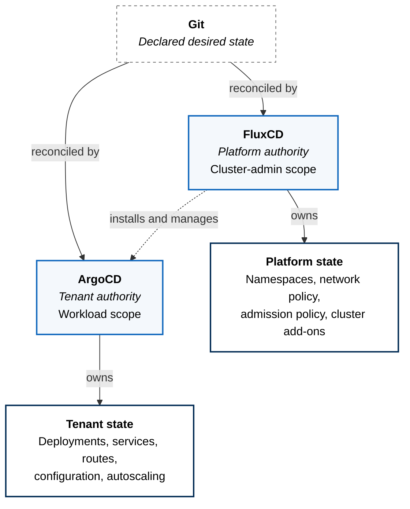
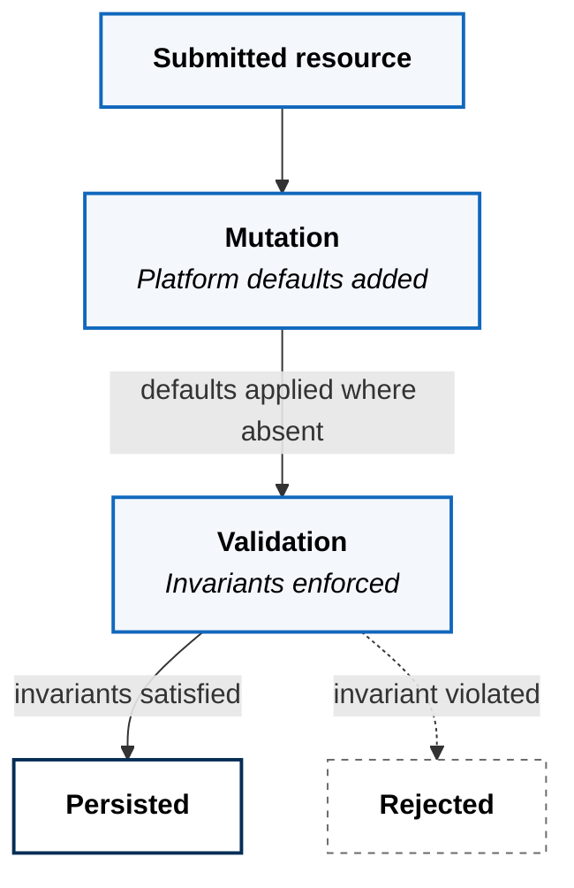
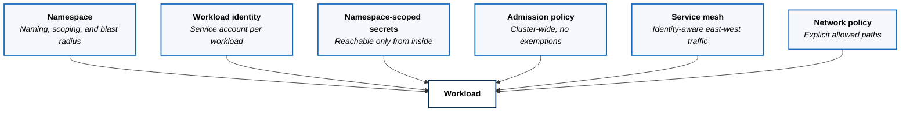

Who is allowed to change a running cluster, and what stops everything else.

## The Problem

A Kubernetes cluster will accept changes from anyone holding a credential. That
is the whole difficulty. Left alone, a platform degrades in one of two
directions.

In the first, change arrives directly. Someone applies a manifest to fix an
incident, it works, and the cluster now contains a resource that exists in no
repository. The cluster and the source of truth have quietly diverged, and
nobody will find out until the next reconcile overwrites the fix or fails to.

In the second, change is centralized so heavily that tenants cannot move. One
reconciler owns everything, every deployment is a platform-team ticket, and
teams start asking for cluster credentials so they can get their work done —
which returns you to the first problem, now with more credentials in
circulation.

The resolution is not a single authority. It is **several authorities with
boundaries that do not overlap**, and a written rule for the rare case that
needs to cross one.

## Two Reconcilers, Split by Scope

ZaveStudios runs two GitOps reconcilers with different jurisdictions. FluxCD
owns the platform. ArgoCD owns tenant workloads.

The dotted arrow is the load-bearing one. ArgoCD is itself a platform
capability, installed and managed by Flux. It cannot modify platform resources
and it cannot modify itself. A tenant with full authority over their workloads
still has no path to the policy that constrains them.

The split is not arbitrary. Flux is built for operators reconciling foundational
state and needs no interface beyond Git. Argo is built for application teams and
gives them something Git alone does not: a view of what is actually running,
and the ability to sync, diff, and roll back their own workload without a
platform-team round trip.

**What this costs.** Two reconcilers mean two failure modes, two upgrade paths,
and two sets of operational knowledge. A single tool would be simpler to run.
The trade buys tenant self-service without handing out cluster-admin, and that
is the thing worth paying for.

## Nothing Reaches the Cluster Unchecked

Reconcilers decide what is applied. Admission control decides what is allowed
to exist at all, and it runs on every resource regardless of which reconciler
submitted it.

Two modes, and which one a requirement uses is a design decision rather than a
preference.

**Mutation** applies platform defaults. Security context baselines, standard
labels, and similar concerns are injected at admission, so workload authors are
not required to know they exist. Defaults are added only where a value is
absent — a workload that sets something deliberately is never overwritten.

**Validation** enforces invariants. Approved image sources, non-root execution,
no privilege escalation. These are conditions a workload is expected to meet,
and failing one blocks admission rather than being silently corrected.

The rule is simple: if a field should be present on every workload whether or
not the author thought about it, default it. If its absence is a security
failure, reject it.

**What this costs.** Policy is invisible until it blocks you, and a rejection at
deploy time is an unpleasant way to learn a rule exists. The mitigation is that
the same policy set runs in CI, evaluated in the same order as the cluster
applies it — mutation first, then validation against the mutated result. A
workload that passes in CI passes admission. The feedback moves to the pull
request, where it is cheap.

## What Separates One Tenant From Another

Isolation is not a single control. It is several, each covering what the others
cannot.

A namespace is the weakest of these on its own. It scopes names and bounds
blast radius, and it stops nothing by itself — two workloads in different
namespaces can still reach each other unless something says otherwise. Treating
the namespace as the isolation boundary is the most common mistake in
multi-tenant Kubernetes.

The controls that do the work are the ones that do not care which namespace
they are in. Admission policy applies cluster-wide with no per-tenant
exemptions — a tenant cannot negotiate its way out of non-root execution.
Secrets are namespace-scoped and issued per workload, so reading another
tenant's credential is not a permissions question but a reachability one.
Identity is per workload rather than per namespace, so a compromised workload
carries its own blame.

**This is layered deliberately, and the layers are not all equally mature.**
Network policy is applied around platform components today and is being
extended outward; mesh-level enforcement is being tightened alongside it.
Isolation here is a programme rather than a finished state, and claiming
otherwise would be the kind of assertion this site exists to avoid.

## The Exceptions Are Written Down

Direct cluster access is not forbidden, because a rule that cannot survive an
incident will simply be broken during one. It is enumerated instead.

**Bootstrap.** Direct access is permitted to install or repair the reconciler
itself. Something has to create the thing that reconciles everything else, and
that step cannot be reconciled by the system it creates.

**Break-glass.** Direct access is permitted for emergency mitigation, on the
condition that the change is returned to Git immediately. The cluster is allowed
to lead the repository for minutes, never for days.

Everything outside those two cases goes through Git. Naming the exceptions is
what keeps them exceptional — an undocumented workaround becomes the normal path
within about a week.

## Where Authority Sits

| State | Owner | Changed by |
|---|---|---|
| Namespaces and network policy | FluxCD | Merge to the platform state |
| Admission policy | FluxCD | Merge to the platform state |
| Cluster add-ons and capabilities | FluxCD | Merge to the platform state |
| ArgoCD itself | FluxCD | Merge to the platform state |
| Tenant deployments and routes | ArgoCD | Merge to tenant state |
| What is allowed to exist at all | Admission control | Merge to the platform state |
| Anything running right now | Nobody | It is a reflection, not a source |

The last row is the point. The runtime is never a source of truth — it is the
observable consequence of state declared elsewhere. The
[control plane model](https://github.com/zavestudios/platform-docs/blob/main/_platform/CONTROL_PLANE_MODEL.md)
defines these boundaries in full.
