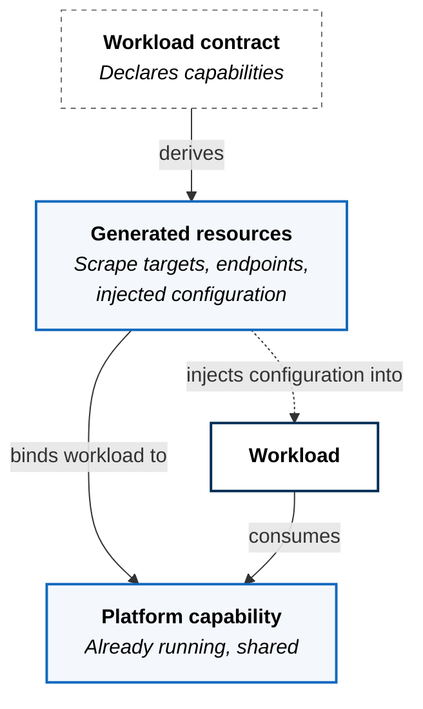
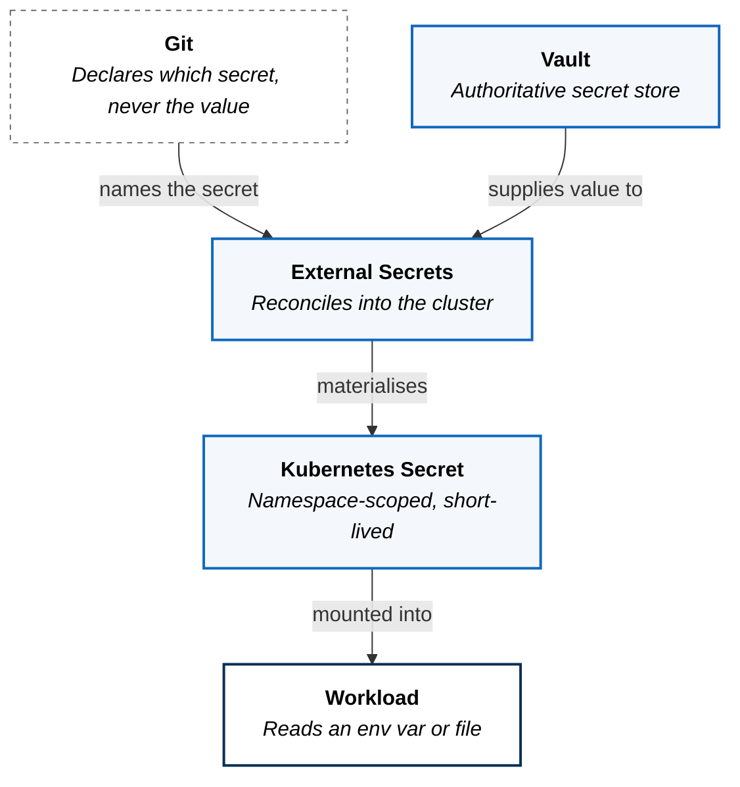

The shared capabilities every workload needs and no workload should have to
build.

## The Problem

Strip away application logic and most workloads need the same short list:
somewhere to authenticate, somewhere to get a credential, somewhere to send
telemetry, somewhere to put objects. None of it is the reason the workload
exists, and all of it is easy to get wrong.

Left to themselves, teams solve these individually. The platform ends up with
four authentication patterns, credentials pasted into environment variables,
three telemetry backends, and no way to answer a question about any of them
across the estate. Every one of those is a security posture nobody chose.

The opposite failure is a platform that owns the capabilities but makes them
expensive to reach — a ticket per database, a meeting per dashboard. Teams
route around the queue, and you are back to four authentication patterns.

So the capabilities are platform-owned, and the interface to them is the
workload contract.

## Capabilities Are Declared, Not Assembled

A workload does not integrate with a platform service. It declares that it
needs one, and the platform materialises the wiring.

```yaml
spec:
  capabilities:
    - name: metrics
    - name: tracing
```

That declaration is the entire tenant-facing surface. What it produces —
scrape configuration, receiver endpoints, injected environment variables, the
routing and policy that go with them — is platform mechanics derived from the
contract.



The workload never learns the address of the thing it is talking to. That
indirection is what lets the platform move, replace, or upgrade a capability
without touching a single tenant repository.

## What The Platform Provides

| Capability | What a tenant does |
|---|---|
| Identity and access | Declares exposure; receives OIDC integration |
| Secret management | Names the secret it needs |
| Metrics | Exposes a named `metrics` port |
| Tracing | Emits OTLP to platform-provided configuration |
| Object storage | Declares a bucket requirement |
| [Workflow orchestration](workflow-orchestration/) | Declares a pipeline workload |
| Delivery and rollback | Nothing — see [Inside the Cluster](../inside-the-cluster/) |
| Admission policy | Nothing — see [Inside the Cluster](../inside-the-cluster/) |

Each capability with a page of its own is linked above; those pages carry the
integration detail rather than repeating it here.

Capabilities are named for what they provide, not for the product currently
providing them. That is the same indirection the contract gives tenants: a
workload declares that it needs tracing, never that it needs a particular
tracing backend.

The right-hand column is the interesting one. In every row the tenant action is
a declaration, never an integration. Nobody configures a scrape job, writes a
tracing exporter, or requests a credential from a person.

## No Workload Holds A Credential

Secrets are the capability most often done badly, so it is worth being explicit
about the path.



Git declares *which* secret a workload needs. It never contains the value. The
value lives in Vault, is reconciled into a namespace-scoped Kubernetes secret,
and reaches the workload as an environment variable or mounted file. A tenant
repository can be read by anyone with access to it and still disclose nothing.

The bootstrap case — the secrets the secret store itself needs before it is
running — is handled by sealed secrets, which are safe to commit because they
can only be decrypted by the cluster that holds the sealing key.

## What This Costs

**Declaration is not the same as materialisation.** A workload can declare a
capability before the platform has finished wiring it up. Declaring `tracing`
does not by itself produce traces; it produces an expectation that the receiver
path exists and that configuration is injected. Where that plumbing is
incomplete, the declaration is conformance debt rather than a working
capability.

The platform tracks this distinction deliberately rather than papering over it.
A capability is considered real when it can be verified at runtime, not when it
appears in a contract. Some of that materialisation is still generated by hand
during Formation Phase, and automating it is ongoing work.

**Shared capabilities are shared failure domains.** One identity provider means
one outage takes authentication away from everything. That is the accepted cost
of not having six of them, and it is why these services are platform-owned,
platform-monitored, and reconciled like everything else.

## Where Authority Sits

| Decision | Owner | Changed by |
|---|---|---|
| Which capabilities exist | Platform | Merge to the platform state |
| How a capability is implemented | Platform | Merge to the platform state |
| Which capabilities a workload uses | Tenant | The workload contract |
| The resources that binding produces | Generated | Derived — not authored |
| The value of any secret | Vault | Never in Git, never in a contract |

Capabilities are a platform product surface, not a service catalogue. The
[contract schema](https://github.com/zavestudios/platform-docs/blob/main/_platform/CONTRACT_SCHEMA.md)
defines what a workload may declare.
