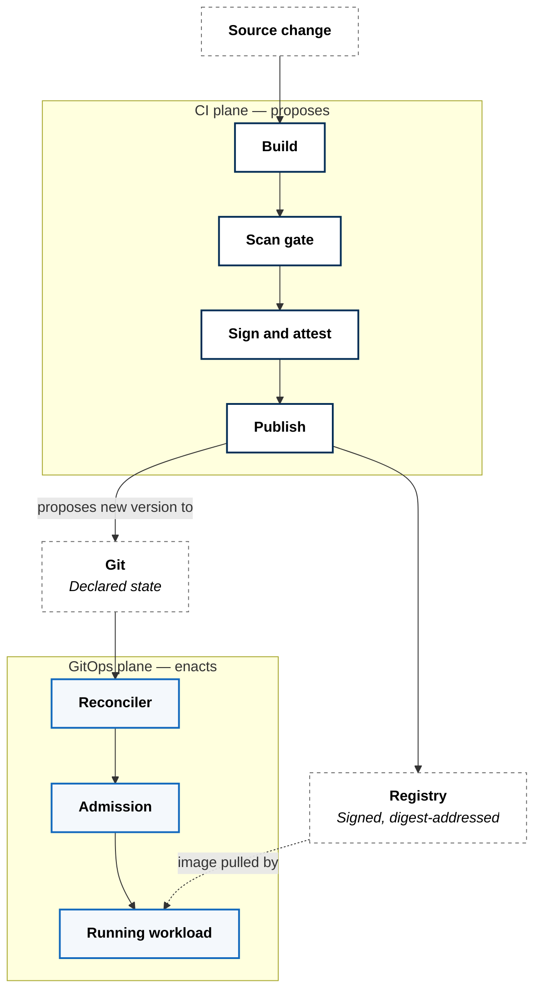
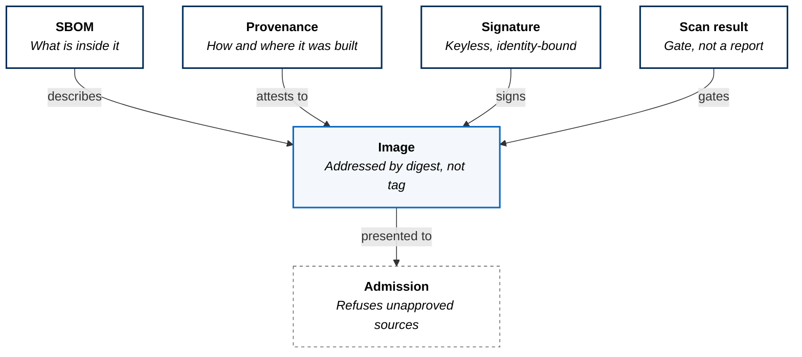
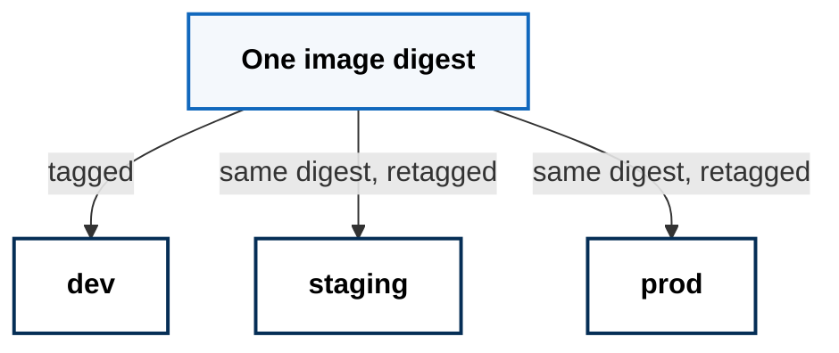

Tenants do not write pipelines. Build, scan, signing, publication, and
promotion are platform capabilities consumed through the workload contract.

## Two Planes, One Boundary

No arrow crosses from the CI plane to the running workload. CI writes to the
registry and to Git; nothing else.

## What Travels With An Image

The digest is the identity. A tag is a label that can be moved; a digest cannot
be. Everything above attaches to the digest, so the thing that was scanned and
signed is provably the thing that runs.

Signing is keyless — identity comes from the pipeline's own OIDC token, so
there is no signing key to store, rotate, or leak.

## Promotion Moves A Label, Not An Artifact

Promotion never rebuilds. Environments are labels pointing at one immutable
artifact, so what was tested in one is bit-identical to what runs in the next.

## The Pipeline's Own Supply Chain

Every external action the pipeline uses is pinned to a commit digest rather
than a version tag. A pipeline that verifies its outputs while trusting mutable
inputs has moved the problem rather than solved it.

---

Currently implemented with GitHub Actions, Trivy, and Sigstore. The capability
is build and provenance; the tools behind it are replaceable.
