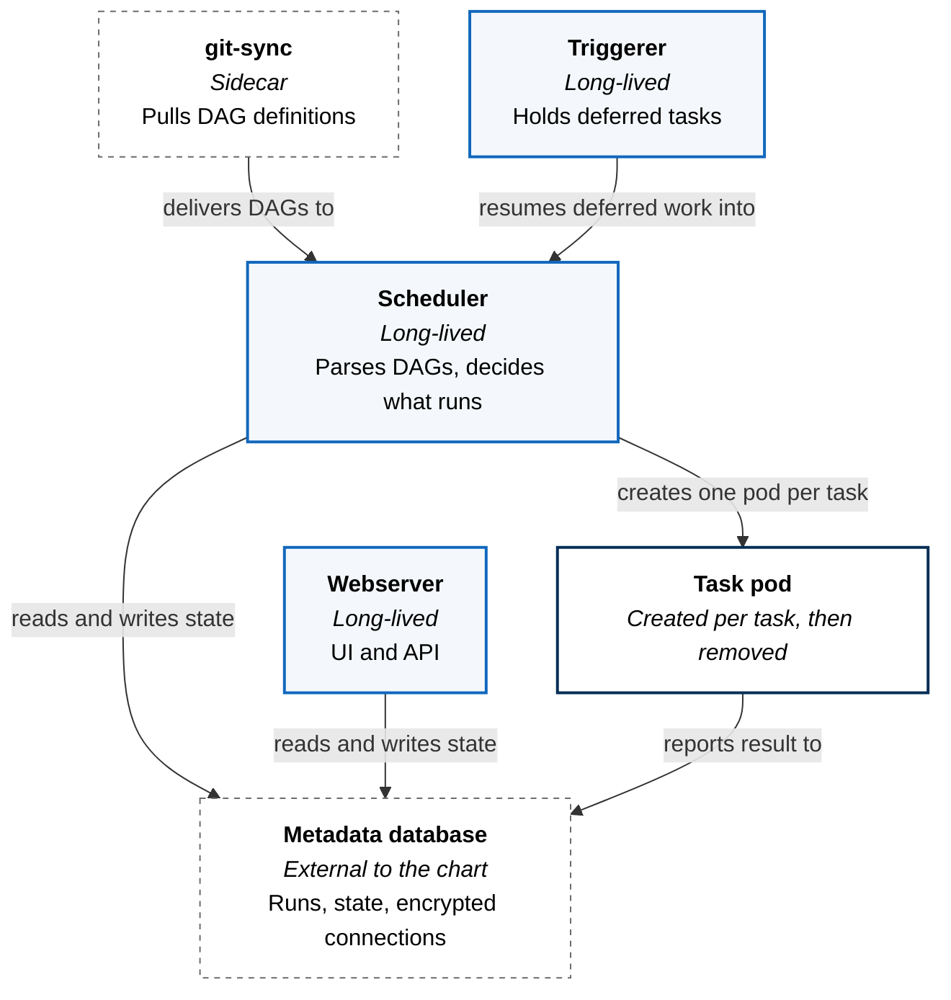
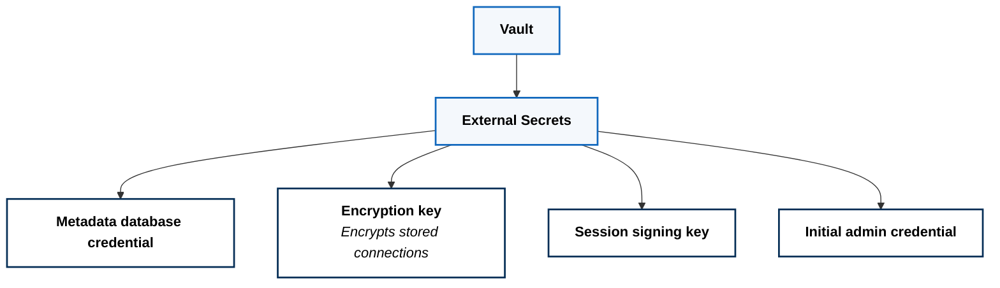

Scheduled and event-driven pipelines, run as ordinary Kubernetes workloads
under the same policy, identity, and secret handling as everything else on the
platform.

The capability is workflow orchestration. It is currently implemented with
Apache Airflow, and the rest of this page describes that implementation — but
the contract a tenant depends on is the capability, not the product behind it.

## Runtime Architecture

The orchestrator is not deployed as a monolith with a worker pool. Its control
components are long-lived; the things that do work are not.

Four components stay running. The scheduler decides what should execute, the
webserver serves the UI and API, the triggerer parks deferred tasks so a waiting
task does not occupy an execution slot, and a sidecar keeps DAG definitions
current.

Everything else is transient.

## Execution: One Pod Per Task

Execution is delegated to Kubernetes. There is no standing pool of workers sized
in advance and idle most of the day. Each task becomes a pod, scheduled like any
other workload, and removed when it finishes.

A task becomes a pod, runs, and is removed. Three consequences follow from that
choice.

Capacity is the cluster's problem, not the orchestrator's. A burst of tasks is a
scheduling question answered by the same mechanism that schedules everything
else, and idle pipelines consume nothing.

Task pods are subject to admission policy like any other pod. A task cannot
pull from an unapproved registry, run as root, or escalate privilege, because
the policy that forbids it does not care which component created the pod.

Successful pods are reaped; failed ones are deliberately kept. A failure is
usually the moment you most want the pod still there to inspect, and reaping it
to keep the namespace tidy trades away the evidence.

Task images are referenced by digest rather than tag, so a pipeline that ran
last month and the same pipeline today are running provably identical code.

## Where DAGs Come From

Pipeline definitions are not baked into the orchestrator image and are not
uploaded. They
live in their own repository and are synced continuously into the scheduler.

That draws a clean line. The platform owns the orchestrator; the team owning a
pipeline owns its DAGs and changes them by merging to their own repository,
without a platform release. It also means the running pipeline definition is
whatever Git says — the same property the rest of the platform depends on,
applied to workflow code.

The cost is a second delivery path. Platform state reaches the cluster by
reconciliation; DAG code arrives by sync. They are different mechanisms with
different failure modes, and a DAG can be syntactically valid, sync
successfully, and still be wrong.

## Credentials

The orchestrator needs several secrets and holds none of them in Git.

The encryption key is the interesting one. The orchestrator stores pipeline
connection details and variables in its own metadata database, which would
otherwise be a second credential store with weaker properties than the first.
That material is encrypted at rest, and the key itself comes from Vault — so
compromising the metadata database yields ciphertext rather than credentials.

The metadata database is external to the deployment rather than a chart-managed
instance inside it. Orchestration state outlives any particular installation of
the orchestrator, and coupling the two means a reinstall is a data migration.

## Reaching It

The orchestrator UI is exposed through the service mesh gateway like any other
workload — the same ingress path described in
[Substrate and Ingress](../../substrate-and-ingress/), with TLS terminating at
the edge and no inbound port anywhere in the cluster. It is not a special case,
and it did not need one.

Task pods run in a namespace separate from the control components, which keeps
pipeline execution inside its own boundary rather than alongside the scheduler
that dispatched it.

## What This Costs

**The metadata database is a hard dependency and a single point of failure.**
Lose it and the scheduler cannot determine what has run. It is external partly
so it can be operated and backed up as a database rather than as a side effect
of a Helm chart.

**Per-task pods trade latency for isolation.** Every task pays pod startup
before it does anything. For pipelines measured in minutes this is invisible;
for very short, very frequent tasks it is not, and those are better modelled as
one task that loops than as many tasks.

**Chart-shaped deployments resist hardening.** Upstream charts do not always
propagate security settings consistently across every component and sidecar they
generate, so parts of this deployment required explicit overrides to satisfy
admission policy. Hardening here is ongoing rather than finished, and the
platform's position is that policy stays strict and the deployment adapts to it,
not the reverse.

**The implementation is replaceable; the capability is not.** Tenants declare
that they need orchestration, never that they need a particular orchestrator.
That indirection is what makes the paragraph above a deployment problem rather
than a platform one.
