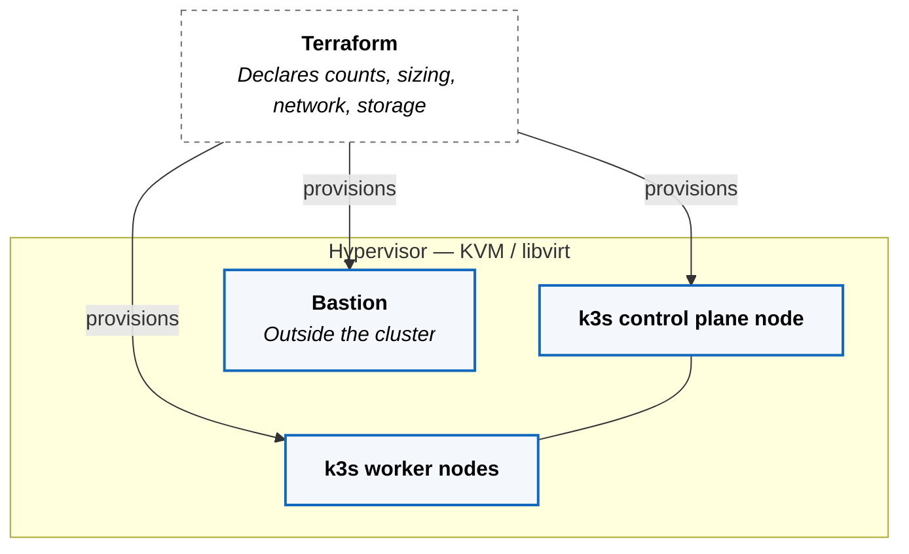

How ZaveStudios runs on its own hardware, and how a request from the public
internet reaches a workload without opening a port.

## The Problem

On-premises platforms fail in two predictable places.

The first is the substrate. Machines get built by hand, drift apart, and become
irreplaceable. The platform then inherits a dependency on a specific machine
that nobody can rebuild, and every subsequent decision is constrained by it.

The second is ingress. Getting traffic from the internet into a private network
usually means exposing something — a forwarded port, a public load balancer, a
DMZ host. Each of those is a listening surface on a network that was private a
moment ago, and each has to be defended forever.

Both are solved the same way: make the answer declarative, and make the
dangerous part someone else's job.

## How We Do Substrate

Every machine is declared, not configured. Virtual machines are described in
Terraform and provisioned onto a KVM/libvirt hypervisor from a versioned,
immutable base image —
one that is rebuilt rather than patched in place. Rebuilding a node is the
normal operation, not the emergency one.

How that image is produced is a supply-chain concern rather than a substrate
one, and is covered separately.



k3s is pinned to an explicit version rather than tracking latest, so an upgrade is a reviewed change with a diff, not a surprise
that arrives on its own schedule.

Cluster credentials live on a bastion that is not itself part of the cluster.
Administrative access is therefore a deliberate act against one known host,
rather than a credential sitting on whichever laptop was nearest.

**What this costs.** The hypervisor is a single point of failure, and the
control plane is not highly available. Both are accepted: this is a reference
implementation where the ability to destroy and rebuild the whole cluster
predictably is worth more than surviving the loss of a node. A production
tenancy would spread the same declarations across more hardware — the
declarations are what port, not the topology.

## How We Do Ingress

Nothing in the cluster listens on a public address. The Cloudflare Tunnel is established
**outbound**, from inside the cluster to Cloudflare. Traffic flows
inward over a connection that was opened from within, so there is no inbound
port to discover, scan, or defend.

```mermaid
flowchart TB
  visitor@{ shape: person, label: "Visitor" }
  edge@{ shape: cloud, label: "Cloudflare — DNS, TLS termination" }

  conn["<b>Cloudflare Tunnel connector</b><br/><i>Dials out, keeps the connection open</i>"]
  gw["<b>Istio ingress gateway</b><br/><i>Service mesh entry point</i>"]
  route["<b>Generated Istio route</b><br/><i>One per exposed workload</i>"]
  pod["<b>Workload</b>"]

  visitor -- "HTTPS" --> edge
  edge -. "carried over the outbound tunnel" .-> conn
  conn -- "plain HTTP, original scheme preserved" --> gw
  gw -- "matches host and path" --> route
  route -- "forwards to" --> pod

  classDef actor     fill:#ffffff,stroke:#052e56,stroke-width:2px,color:#000000
  classDef external  fill:#ffffff,stroke:#6b6b6b,stroke-width:1px,color:#000000,stroke-dasharray: 4 4
  classDef incluster fill:#f4f8fc,stroke:#1168bd,stroke-width:2px,color:#000000
  class visitor actor
  class edge external
  class conn,gw,route,pod incluster
```

**Reading the diagram.** Dashed grey is outside the cluster. Solid blue runs
inside it. A dotted arrow marks a connection established in the opposite
direction to the traffic flowing over it.

TLS terminates at Cloudflare. Inside the cluster the request travels as plain
HTTP with its original scheme preserved in a forwarded header, so workloads
still know they were reached over HTTPS without every workload holding a
certificate.

**What this costs.** Cloudflare becomes a hard dependency. If it is
unreachable, the platform is unreachable — there is no second path in, by
design. This is a deliberate trade: a dependency on a provider whose entire
business is absorbing that traffic, in exchange for a private network with no
listening surface on it at all.

## What a Tenant Sees

None of the above is a tenant concern. Exposure is declared as intent in the
workload contract, and every routing resource is generated from it.

```yaml
apiVersion: zave.io/v1
kind: Workload
metadata:
  name: <service-name>

spec:
  runtime: <runtime>
  exposure: <exposure-type>
  delivery: <strategy>
```

One field decides whether a workload is reachable. The gateway configuration,
the route, the forwarded headers, and the policy attached to them are platform
mechanics derived from that field.

This is not a convenience. Free-form ingress and network policy definitions are
refused outright by
[Tier 0 doctrine](https://github.com/zavestudios/platform-docs/blob/main/_platform/ARCHITECTURAL_DOCTRINE_TIER0.md) —
a tenant cannot write a gateway rule, because a platform that allows arbitrary
ingress has no meaningful security posture to describe.

## Where Authority Sits

| Decision | Plane | Changed by |
|---|---|---|
| Base image contents | Runtime substrate | Reviewed change, rebuild |
| Machine count, sizing, network | Runtime substrate | Reviewed change, reprovision |
| Kubernetes version | Runtime substrate | Reviewed change, explicit pin |
| Tunnel and gateway configuration | GitOps | Merge to the state repository |
| Whether a workload is exposed | Contract | Tenant, in the workload contract |
| The routing that results | GitOps | Generated — not authored |

The pattern holds across the platform: tenants declare intent, the platform
derives mechanics, and Git is the only path to runtime state. The
[control plane model](https://github.com/zavestudios/platform-docs/blob/main/_platform/CONTROL_PLANE_MODEL.md)
defines those boundaries in full.
