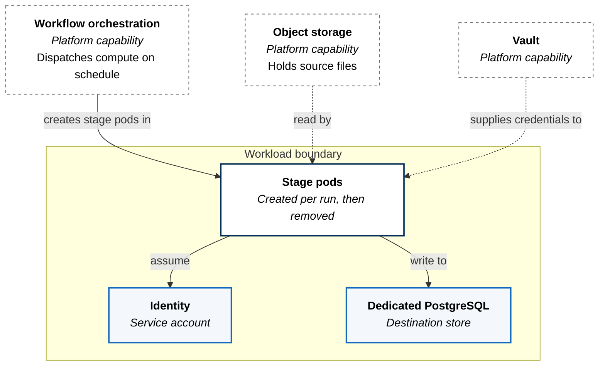
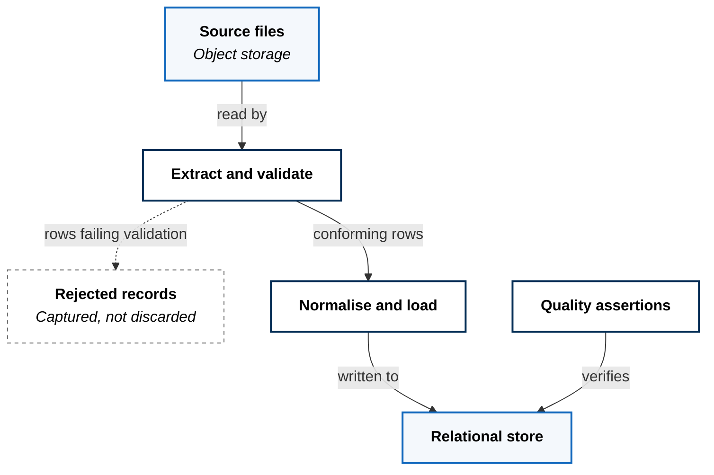

A scheduled pipeline that pulls flat files from object storage, validates and
normalises them, loads them into a relational store, and then checks its own
work.

## A Workload With No Resident Compute

Its contract declares three things, and one of them is that nothing is
reachable:

```yaml
spec:
  runtime: container
  exposure: none
  delivery: rolling
```

What exists permanently is a database, a credential set, and an identity.
Compute is not resident — it is dispatched in by the platform's
[workflow orchestration](../../platform-services/workflow-orchestration/)
capability when work is due, and removed when it finishes.



An idle pipeline costs a database and nothing else. This is the shape most
batch work should take and frequently does not — a scheduler and a worker pool
sitting resident all day to be busy for twenty minutes.

## The Data Path

Three stages, each its own pod, each independently scheduled, resourced, and
retried.



Three decisions are encoded in that shape.

**Validation precedes the database.** Nothing malformed reaches the destination
store, because the stage that could write it has not run yet. Rejecting at the
boundary is cheaper than reconciling afterwards, and it keeps the destination's
constraints as a safety net rather than the primary defence.

**Rejected records are captured, not dropped.** A row that fails validation is
written to a reject stream rather than aborting the batch or vanishing. A batch
that is ninety per cent good delivers ninety per cent of its value, and the
remainder is inspectable rather than lost. The alternative — fail the whole run
on one bad row — makes data quality someone's emergency instead of their
backlog.

**Quality assertions run after the load, not instead of it.** Validation checks
that records are well-formed; assertions check that the loaded result is
plausible. They are different questions, and running the second against the
destination store means it catches problems introduced by the load itself, not
only problems present in the source.

## Scheduling

The pipeline runs daily and does not backfill. A missed window is not
automatically made up when the platform returns.

That is deliberate. Automatic catch-up after an outage produces a burst of
simultaneous runs at precisely the moment a system is least able to absorb one,
and for a daily full-file ingest the next scheduled run generally supersedes the
missed one anyway. Where a gap genuinely matters, a deliberate re-run is a
better answer than an automatic stampede.

## What This Costs

**Stage isolation costs latency.** Three pods mean three startups, and state
does not carry between them — anything one stage learns must be written
somewhere the next can read. A single process would be faster and simpler. The
trade buys independent retry and independent resourcing: a failure in quality
assertions does not re-run the extraction, and a memory-hungry load stage does
not size the whole pipeline.

**Daily granularity is a floor, not a design.** Nothing here is incremental —
each run processes a file rather than a change set. That is appropriate for
source data that arrives as periodic snapshots and wrong for anything
approaching a stream, and moving to streaming would not be a tuning change.

**The destination is a single point of failure**, dedicated to this workload
rather than shared, for the same reason as elsewhere: the pipeline's
correctness depends on its transactional behaviour, and sharing would make
another workload's load a correctness concern.
