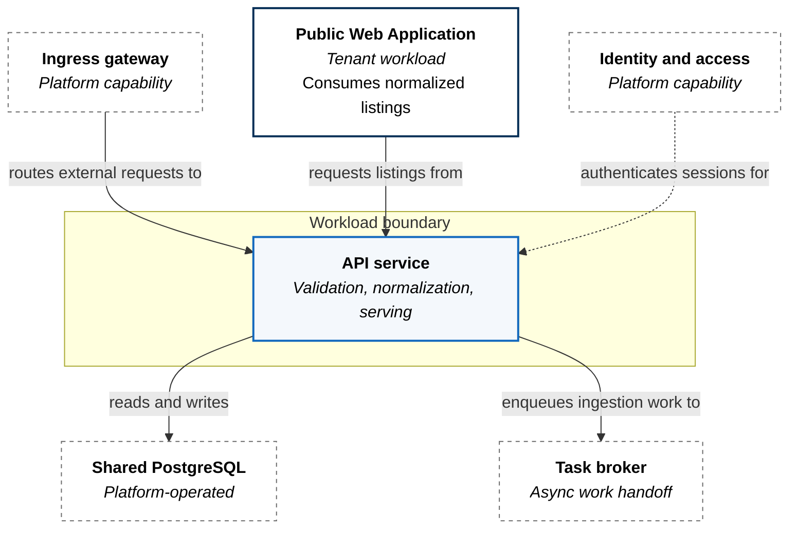
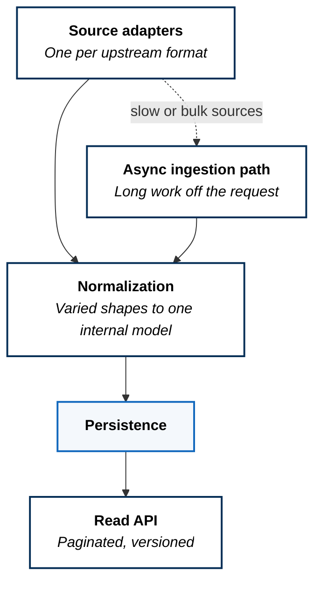

A long-running service that ingests listing data from varied sources,
normalizes it to one internal shape, and serves it to other workloads over a
versioned HTTP API.

## Two Ingestion Architectures, Deliberately

The platform ingests the same class of data two ways. The
[batch pipeline](../batch-ingestion-pipeline/) processes periodic snapshots
with compute dispatched on a schedule. This service ingests continuously and
stays resident, because it also answers queries.

That is not duplication. A scheduled job cannot serve an API, and a resident
service is the wrong place to run a nightly full-file load. The two shapes
answer different questions about the same data.

## The Service In Context

This is the first workload on the platform with a **peer** — another tenant
workload that depends on it. That changes its obligations. A workload nothing
consumes can break its own contract freely; this one cannot, because something
downstream is shaped by the response it returns.

The API is versioned in its path for that reason. Version is the mechanism by
which the two workloads can be deployed independently, which is the whole
justification for them being separate workloads at all.

## Persistence Is Shared, Not Dedicated

The job executor and the batch pipeline each run their own database. This
service uses a platform-operated shared instance, and the difference is
deliberate.

Those two workloads depend on transactional behavior for *correctness* — lease
semantics in one, load atomicity in the other — so another tenant's load
becomes a correctness risk rather than a performance one. This service performs
ordinary reads and writes where contention is a latency problem, not a
soundness problem.

The rule that falls out: **dedicate the datastore when correctness depends on
its behavior under load; share it when only speed does.**

## Internal Structure

Source adapters are per-format and isolated, so adding an upstream means adding
an adapter rather than modifying normalization. Everything converges on a single
internal model before persistence, which is what makes the served shape stable
while upstreams change independently.

Ingestion that cannot complete inside a request is handed to an async path
rather than held open. A synchronous bulk import would couple ingestion
throughput to request timeouts, which is a coupling with no upside.

## Health Is Three Questions

The service answers liveness and readiness separately rather than exposing one
health endpoint.

They mean different things and have opposite failure responses. Liveness asks
whether the process should be killed and replaced. Readiness asks whether it
should receive traffic right now. A service waiting on a slow dependency is not
ready but is perfectly alive, and conflating the two turns a brief dependency
delay into a restart loop that guarantees the outage it was meant to prevent.

## What This Costs

**Having a consumer constrains it.** Response shape is now a contract with
another workload, and breaking it breaks something else. Versioning makes that
manageable rather than free — it means maintaining more than one shape during
any transition.

**The shared datastore is a shared fate.** The reasoning above holds for
correctness, but a shared instance still means a noisy neighbour is felt here,
and an outage there is an outage here.

**The async path is configured but not yet materialized.** Broker and result
backend are wired into the service, and no worker tier is present in the
deployed state. Work enqueued today has nothing consuming it. That is declared
intent rather than completed behavior, and it is tracked as conformance debt
rather than treated as finished.
