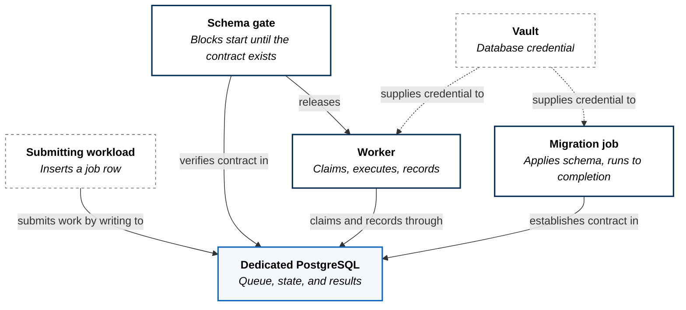
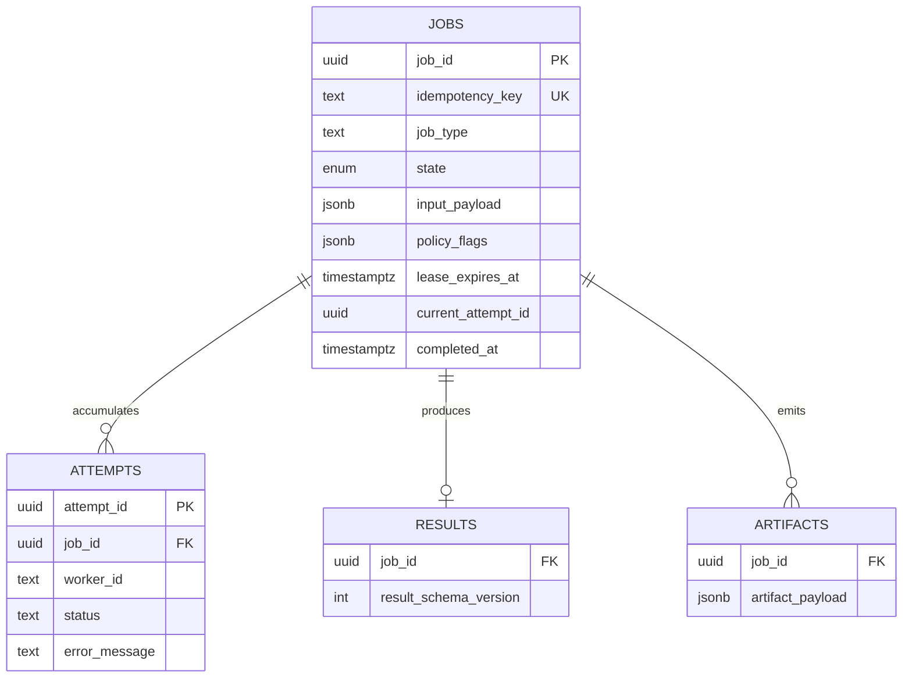
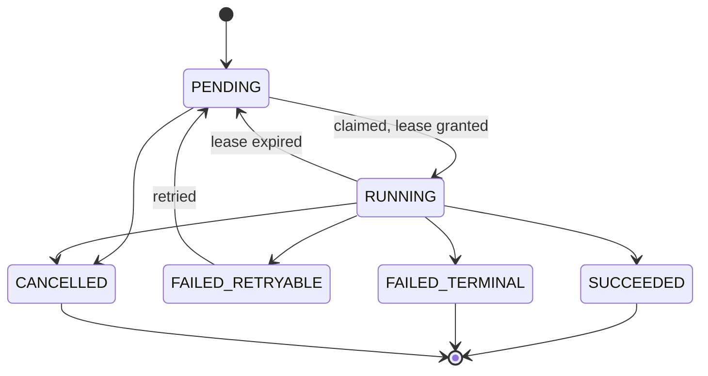

Asynchronous work with exactly-once submission, explicit failure taxonomy, and
crash recovery that requires no supervision.

## It Has No API

The first structural fact is what is absent. This workload exposes no HTTP
service and holds no route. Nothing reaches it through the gateway, because
nothing needs to.

The database is the interface. Submitting work means writing a row; collecting a
result means reading one. There is no protocol to version, no client library to
distribute, and no endpoint to secure — the only access path is one already
governed by credentials the platform issues.

The datastore is dedicated rather than shared. Queue semantics depend on
transactional guarantees and lock behaviour that are properties of *this*
database's configuration, and sharing it would make another workload's load a
correctness concern rather than a performance one.

## The Execution Contract

The schema is not storage for the application's logic. It **is** the logic.

Four relations, each earning its place.

A **job** is the request and its lifecycle. Its `idempotency_key` carries a
uniqueness constraint, so submitting the same work twice is safe by
construction rather than by convention — the second insert fails at the database
rather than producing a duplicate run.

**Attempts** are separate rows rather than a counter on the job. Every try
records which worker took it and why it failed, so retry history survives the
job's eventual success. A counter would tell you a job failed three times; this
tells you it failed on three different workers with three different errors,
which is the difference between knowing something is flaky and knowing why.

**Results** carry a schema version, so the shape of a result can evolve without
invalidating what is already stored.

## Invariants Live In The Database

States are an enumerated type, not a string column.

Two design decisions are visible here.

**Retryable and terminal failure are different states**, not a boolean on a
generic failure. A malformed input and an unreachable dependency are not the
same event, and collapsing them means either retrying what can never succeed or
abandoning what would have worked on the next attempt.

**Lease expiry returns work to the queue automatically.** A worker claims a job
and holds a lease for a bounded period. If the worker dies, nothing needs to
notice — the lease simply expires and the job becomes claimable again. Crash
recovery is the absence of a mechanism rather than the presence of one.

Both are enforced below the application. A check constraint requires that a
lease exists if and only if a job is running, so a crash mid-transition cannot
leave a job running without a lease or holding a lease without running. Another
requires that a succeeded job has a completion timestamp. Application code
cannot write a contradictory row even if it tries, and a second implementation
in another language would inherit the same guarantees for free.

## Schema Before Start

Two components exist solely to guarantee ordering.

A migration job applies the schema and runs to completion, with a bounded retry
budget. Independently, an initialisation gate on the worker blocks startup until
it can observe that the contract actually exists, polling rather than assuming.

The gate does not check that the database is reachable — it checks that the
expected relations are present. A worker that starts against a reachable but
unmigrated database is a worse failure than one that never starts, because it
fails at the first claim rather than at boot, and it does so repeatedly.

This is ordering achieved without an orchestrator. Neither component knows about
the other; both derive their sequencing from observable state.

## What This Costs

**Throughput has a ceiling.** A relational database as a queue is bounded by
transaction rate, and at high volume a purpose-built broker outperforms it. The
trade buys durability, queryability, and transactional consistency between the
queue and the results — properties a broker does not provide. The estate's work
is long-running and moderate in volume, where that trade is correct; it would be
the wrong choice for high-frequency messaging.

**The datastore is a single point of failure.** Lose it and no work is claimed,
recorded, or recoverable. Everything durable about the design depends on that
one component, which is why it is dedicated, backed up, and not shared.

**Lease duration is a guess.** Too short and healthy long-running work is
reclaimed while still executing; too long and a crashed worker's jobs sit idle
until expiry. There is no value that is correct for every job type, and the
current setting favours quick recovery over tolerance for slow tasks.

**A single worker is running today.** The lease design supports many without
coordination changes — claiming is already safe under concurrency — but
horizontal scale is untested rather than proven.
