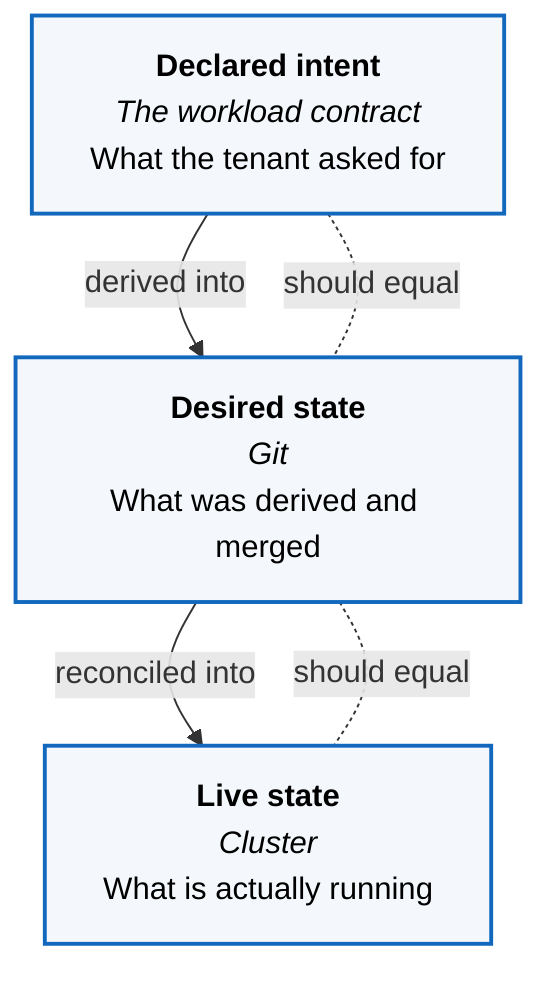
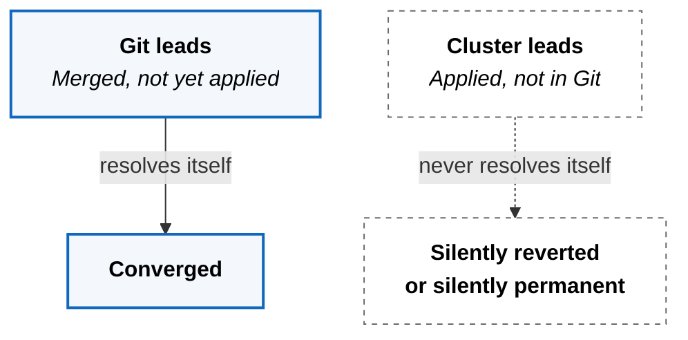

How you tell whether the platform is right, and how you find where it went
wrong.

This is not a runbook. It is the diagnostic method: what the platform compares
against what, and what a mismatch at each boundary actually means.

## Three Statements Of The Same System

At any moment the platform holds three descriptions of what should be running.
Health is whether they agree.

Diagnosis is not "what is broken." It is **which pair disagrees**, because the
answer determines where to look and nothing else does.

## What Each Mismatch Means

| Disagreement | Meaning | Where the fault is |
|---|---|---|
| Intent ≠ desired | What was asked for was never derived | Validation or generation |
| Desired ≠ live | What was merged was not applied | Reconciliation, or admission refused it |
| Live changed on its own | Something wrote directly to the cluster | A bypass of the delivery path |
| All three agree, behaviour wrong | The contract expressed the wrong thing | The request, not the platform |

The last row is the one most often misdiagnosed. A system that is perfectly
reconciled and still behaving wrongly is not broken — it is doing exactly what
was declared, and the declaration is the defect.

## Drift Has A Direction

The two directions are not symmetric, and treating them as one kind of problem
is the mistake.

Git ahead of the cluster is ordinary and self-correcting — reconciliation is
pending, and waiting is a valid response. Cluster ahead of Git never corrects
itself. It is either erased by the next reconciliation, destroying work nobody
recorded, or it persists in a resource nothing manages, which is worse because
it survives.

That asymmetry is why direct cluster changes are enumerated rather than
forbidden outright, and why break-glass carries an obligation to return the
change to Git immediately. The exception is not the write; it is leaving it
there.

## Observability Answers A Different Question

Telemetry tells you how the system is behaving. The three-way comparison tells
you whether it is what you asked for. A workload can be healthy by every metric
and still be the wrong workload, and it can be correct by all three
descriptions and still be failing under load.

Both are needed, and confusing them wastes the outage.
