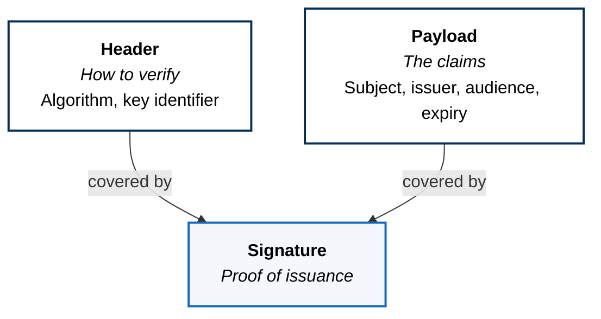
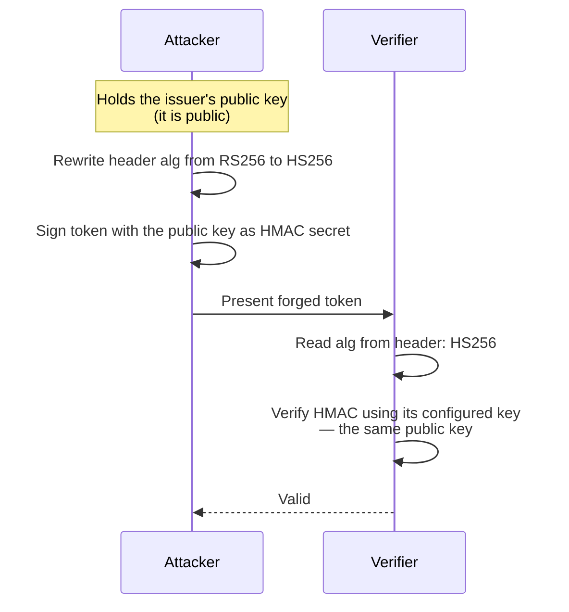
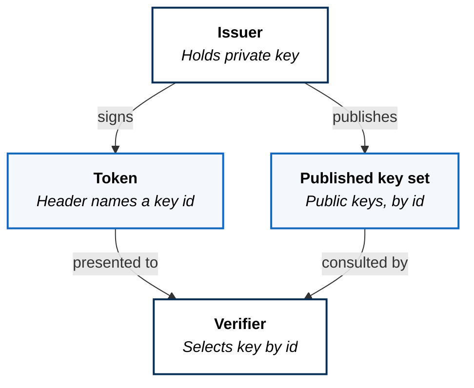

A JWT replaces a database lookup with a signature. Every property it has, good
and bad, follows from that one substitution.

Traditionally, proving who you are means presenting a reference — a session
identifier — and the server looking it up. The lookup is authoritative,
revocable, and requires shared state. A JWT inverts this: the token *carries*
the claims, and a signature proves they were issued by someone trusted. No
lookup, no shared state, and therefore no way to take it back.

Most of what follows is a consequence of that trade rather than a separate
fact to memorize.

## Anatomy

Three parts, dot-separated, each base64url-encoded.

**Base64url is an encoding, not encryption.** Anyone holding the token can read
every claim in it without the key — decoding requires nothing. The signature
makes the contents *tamper-evident*, not *secret*. A token is a postcard with a
wax seal: you cannot alter it unnoticed, and you cannot stop anyone reading it.

That single sentence disposes of the most common production mistake, which is
putting something in a payload that shouldn't be public.

## Verification Is A Set Of Checks, Not One

A valid signature is necessary and nowhere near sufficient.

| Check | What it prevents |
|---|---|
| Signature over header and payload | Tampering and forgery |
| alg matches what the verifier expects | Algorithm substitution |
| iss is a trusted issuer | Tokens minted elsewhere |
| aud names *this* service | A token for one service accepted by another |
| exp has not passed | Indefinite reuse |
| nbf has passed | Tokens used before their window |

**A token does not expire. A verifier refuses it.** Nothing in a JWT enforces
anything — exp is a number in a readable payload, and a verifier that does
not check it has issued permanent credentials. Every item above is work the
verifier must do, and each one skipped is a control that silently does not
exist.

The audience check is the one most often omitted and the most quietly
dangerous. Without it, a token minted for a low-value service is accepted by a
high-value one, and the blast radius of any single token becomes the whole
estate.

## The Header Is Attacker-Controlled

The token states how to verify itself. A verifier that believes it has handed
the attacker the method.

This is algorithm confusion, and it is subtler than the better-known alg:
none. The verifier never accepts an unsigned token and never skips a check. It
is fooled into using an asymmetric public key — material designed to be
distributed freely — as a symmetric shared secret.

The defence is one line of principle: **the verifier decides the algorithm, the
token does not.** A verifier configured to accept exactly RS256 is immune to
both attacks, and a library that infers the algorithm from the token is
dangerous regardless of how carefully it validates everything else.

## Keys, And Why kid Exists

The key identifier exists so that rotation does not require simultaneity. The
issuer publishes a new key alongside the old one, begins signing with the new,
and retires the old once every token bearing it has expired. Verifiers follow
by reading the published set. Without a key identifier, rotation means every
verifier changing configuration at the same instant, which at any real scale
means an outage.

Note the direction of trust: the verifier trusts the *issuer's published key
set*, not the token. The token only says which key to use.

## What Statelessness Costs

**Revocation.** There is no lookup, so there is nothing to delete. A token
compromised one minute after issuance remains valid until it expires. The
standard mitigations are short expiry and refresh tokens — but a refresh token
is checked against a store, which is a lookup, which is the state the design
removed. The honest description is that statelessness is preserved for the
common path and abandoned for the sensitive one.

**Possession is authorization.** A bearer token grants its holder everything it
claims, with no proof the holder is the party it was issued to. Stealing one is
sufficient. This is why proof-of-possession schemes and mutual TLS exist — they bind a
credential to a party rather than to whoever is carrying it.

**Staleness.** Claims are true as of issuance. Revoked privileges, closed
accounts, and changed roles are invisible until expiry. Long-lived tokens are
comfortable and wrong.

## What A Signature Does Not Prove

A verified signature proves the token was issued by the holder of a key and has
not been altered. It proves nothing about whether the bearer should be allowed
to do the thing they are asking to do.

Authentication and authorization collapse into one step surprisingly often,
usually as *this token is valid, therefore proceed*. A token is evidence about
identity. The decision that follows is a separate question with a separate
answer, and conflating them is how an expired understanding of someone's
privileges survives inside a perfectly valid credential.

---

Applied on this platform in
[Substrate and Ingress](../../../architecture/substrate-and-ingress/), where
requests arrive carrying tokens, and in
[Platform Services](../../../architecture/platform-services/), where identity
is a capability rather than a per-workload integration.
