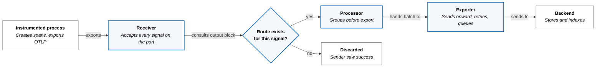
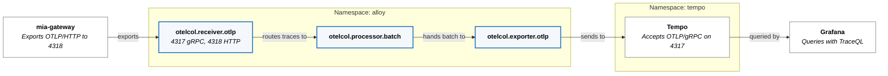

A span is created inside a process and has to end up in a store that something
else queries. Between those two points sit a wire format, a collector, one or
more network boundaries, a batch window, and a buffer. Each of them can lose the
span. A refused connection and a full export queue reach the sender as errors;
a signal with no route, an exhausted retry budget, and a buffer lost on restart
do not.

This study distinguishes four OpenTelemetry concepts: the specification, the wire
protocol (OTLP), the language SDKs that produce data, and the Collector that
moves it. The project covers more than these four; these are the ones the
pipeline below depends on. This
study covers the protocol and the pipeline. It uses traces as the worked signal,
and the reason that restriction matters turns out to be the most useful thing
here.

## What OTLP Standardizes

OTLP fixes what would otherwise be negotiated between every producer and every
backend.

| Decision | What OTLP specifies |
|---|---|
| Transport | OTLP/gRPC, or OTLP/HTTP |
| Port | 4317 for gRPC, 4318 for HTTP |
| Path | `/v1/traces`, `/v1/metrics`, `/v1/logs` for OTLP/HTTP |
| OTLP/HTTP content type | `application/x-protobuf` or `application/json`. OTLP/gRPC carries protobuf over gRPC and does not use these. |
| Failure semantics | retryable, non-retryable, and partial success |

Those ports and paths are defaults, not guarantees: "Non-default URL paths for
requests MAY be configured on the client and server sides." Naming the port
explicitly in a client configuration is therefore worth the extra line.

Two failure rules are commonly inverted. A retryable error means the client
"SHOULD record the error and may retry," using exponential backoff. **Partial
success is not a failure.** It arrives as HTTP 200 with a populated
`partial_success` field, and "the client MUST NOT retry the request." Part of the
payload was rejected and the rest was accepted, so resending duplicates the
accepted part. A client that treats partial success as an error produces
duplicate spans instead of recovering lost ones.

## A Pipeline Is Components Wired per Signal

The Collector model has three component kinds — receivers, processors, exporters
— and the wiring between them is declared **per signal**, not once per pipeline.
A receiver listening on a port accepts every signal type sent to it. What
happens next depends entirely on whether a route exists for that signal.

In Alloy's configuration language the route is an `output` block:

```alloy
otelcol.receiver.otlp "receiver" {
  grpc { endpoint = "0.0.0.0:4317" }
  http { endpoint = "0.0.0.0:4318" }

  output {
    traces = [otelcol.processor.batch.default.input]
  }
}
```

That block is the entire routing table. A signal absent from it has no
consumers, and the reference states the consequence directly: "by default,
telemetry data is dropped."

The drop happens **after acceptance**. The receiver has already returned a
success response, because the request was well-formed and arrived intact. From
the client's position the export succeeded. Reachability and routing are
independent properties, and a sender can only observe the first.



## Five Ways a Pipeline Loses Data

The hops are distinguishable, which is what makes a missing trace diagnosable
rather than mysterious.

| Loss | Where | Visible to sender |
|---|---|---|
| Connection refused or denied | Network boundary before the receiver | Yes — the export fails |
| Export queue full | Exporter, when the queue is saturated | Yes — a retryable error propagates back |
| No route for the signal | Receiver's `output` block | No — export returned success |
| Retry budget exhausted | Exporter, after backoff | No |
| Buffer lost on restart | Exporter's in-memory queue | No |

The first two surface as errors at the sender: a queue with `block_on_overflow`
left at its default of `false` means "operations will immediately return a
retryable error," so saturation is reported rather than hidden. The last three
are silent at the sender and visible only in the collector's own telemetry, which
is why a collector that does not export metrics about itself is difficult to
operate.

## Batching Is a Three-Term Trade

A batch processor groups records before export, and the settings are usually
described as a latency-versus-throughput trade. There is a third term.

- `send_batch_size` — the count that triggers a flush. Larger means fewer, bigger
  requests.
- `timeout` — how long to wait before flushing an incomplete batch. Under low
  traffic a longer timeout produces larger batches and delays every record by up
  to that interval; under high traffic `send_batch_size` is reached first and the
  timeout rarely applies.
- `send_batch_max_size` — the upper bound on a batch. The documented constraint
  is that it "must be greater than or equal to `send_batch_size`," and the value
  `0` means "batches can be any size," removing the bound.

The third term is loss. Whatever is held in an unflushed batch is in memory in
one process, so a batch window is also a statement about how much data is
acceptable to lose when that process dies. Raising the size and the timeout
together increases throughput and increases the amount at risk, and removing the
maximum means a single request to the backend has no size ceiling the collector
will enforce.

A receiver's own request-size limit does not bound this. It constrains each
incoming request, not the size of what the collector later sends onward.

## Retries and Queues Decide What an Outage Costs

An OTLP exporter typically pairs a retry policy with a queue, and the two answer
different questions.

Retry policy answers *how long to keep trying*. With an elapsed-time budget, the
behavior at the end of it is explicit: "If a batch hasn't been sent
successfully, it's discarded after the time specified by `max_elapsed_time`
elapses." Setting that budget to `0s` retries forever instead, which trades
bounded loss for retries that occupy a queue slot indefinitely.

The queue answers *what happens while trying*, and four of its settings decide
that answer:

- `queue_size` — how many requests may wait. The default is `1000`, so the buffer
  is bounded whatever the retry budget says.
- `block_on_overflow` — what happens once it is full. Default `false`, meaning
  "operations will immediately return a retryable error" rather than applying
  backpressure.
- `wait_for_result` — whether the caller learns the export outcome. Default
  `false`, so a successful enqueue is not a successful delivery.
- `storage` — optional. Without a storage component the queue is in memory, so a
  process restart loses it, and a collector running a single replica has no second
  copy.

Those two bounds interact, which is why outage tolerance cannot be read off the
retry budget alone. A quiet pipeline may absorb an outage for the full budget. A
busy one fills `queue_size` first and begins returning retryable errors well
before the budget expires. Which of the two happens depends on throughput, not on
configuration.

## `insecure` Is Not `insecure_skip_verify`

Two TLS settings on an exporter have names that suggest a gradient, and they are
not one.

- `insecure` "disables TLS when connecting to the configured server." No TLS
  session is established.
- `insecure_skip_verify` "ignores insecure server TLS certificates." TLS is
  negotiated and the connection is encrypted; only certificate validation is
  skipped.

They are not degrees of the same thing. The first removes the layer; the second
keeps the layer and removes an identity check. Setting both leaves the second
with nothing to act on, which is harmless and misleading — a reader scanning the
configuration sees two mitigating qualifiers where one setting is doing all the
work.

Choosing between them is a question about what the surrounding network already
guarantees. In Kubernetes the concrete form of that question is which
NetworkPolicy admits traffic to the port, because that is what remains when TLS
is not establishing identity.

---

## How This Platform Implements It

The path is a tenant workload, a collector in its own namespace, and Tempo.



The workload configures transport and nothing else:

```yaml
- name: OTEL_EXPORTER_OTLP_ENDPOINT
  value: "http://alloy-receiver.alloy.svc.cluster.local:4318"
- name: OTEL_EXPORTER_OTLP_PROTOCOL
  value: "http/protobuf"
- name: OTEL_SERVICE_NAME
  value: "mia-gateway"
```

It does not reference Tempo. That indirection buys several things at once —
centralized routing, processing, retry, and a policy enforcement point — and one
of them is that the backend can be replaced without changing or redeploying the
workload.

Each hop carries a NetworkPolicy on the receiving side, and each names the
sending pod rather than the namespace alone — the `alloy` policy admits
`app: mia` on 4317 and 4318, and the `tempo` policy admits
`app.kubernetes.io/name: alloy-receiver` on 4317 only. The second policy is what
makes the collector a boundary instead of a convenience, because a workload
cannot skip it by addressing Tempo directly. `OBSERVABILITY_MODEL.md` requires
exactly that — "workloads do not send traces directly to Tempo" — and the policy
is what enforces a sentence that would otherwise be advice.

One asymmetry is worth noting: the Tempo policy admits 4317 only, so an attempt
to reach Tempo over OTLP/HTTP on 4318 is denied by that policy. Whether Tempo
listens on 4318 at all is a separate question the repository does not answer.

## Where This Platform Diverges

Four discrepancies, in descending order of how much they matter.

**A workload asks for three signals and the pipeline routes one.** The `mia`
configuration sets `traces: true, metrics: true, logs: true`, and the receiver's
`output` block routes `traces` alone. Alloy documents the consequence for an
unrouted signal — "by default, telemetry data is dropped" — so metrics and logs
sent to this receiver have no destination. What this deployment actually does
with them is untested: whether `mia` emits all three in practice, and what
response its exporter receives, are listed as unverified below. The routing
itself is deliberate —
`OBSERVABILITY_MODEL.md` makes OTLP the trace path and says "OTLP metrics
emitted by a workload may be useful implementation detail, but do not by
themselves satisfy the current Formation `metrics` capability contract," with
metrics arriving by Prometheus scraping and logs by Loki. The divergence is not
the routing. It is that the producer declares three signals, nothing rejects
two of them, and no configuration on either side records that they go nowhere.

**Nine of the fifteen settings restate the default.** One row per value set in
the configmap:

| Setting | Configured | Default | |
|---|---|---|---|
| `grpc.endpoint` | `0.0.0.0:4317` | `0.0.0.0:4317` | same |
| `http.endpoint` | `0.0.0.0:4318` | `0.0.0.0:4318` | same |
| `http.include_metadata` | `false` | `false` | same |
| `http.max_request_body_size` | `20MiB` | `20MiB` | same |
| `retry_on_failure.enabled` | `true` | `true` | same |
| `retry_on_failure.initial_interval` | `5s` | `5s` | same |
| `retry_on_failure.max_interval` | `30s` | `30s` | same |
| `retry_on_failure.max_elapsed_time` | `5m` | `5m` | same |
| `sending_queue.enabled` | `true` | `true` | same |
| `send_batch_size` | `8192` | `2000` | changed |
| `send_batch_max_size` | `0` | `3000` | changed |
| `timeout` | `2s` | `200ms` | changed |
| `client.endpoint` | Tempo service | none — required | required |
| `tls.insecure` | `true` | `false` | changed |
| `tls.insecure_skip_verify` | `true` | `false` | changed |

Six rows are decisions: the three batch settings, the required endpoint, and the
two TLS settings. The other nine read as deliberate and are not, which will
mislead whoever changes one of those defaults upstream and cannot tell which
lines here were chosen.

The settings that most affect outage behavior are not in the file at all.
`queue_size`, `block_on_overflow`, `wait_for_result`, and `storage` are all
inherited silently, so the queue is bounded at `1000`, non-blocking, and
in-memory by omission rather than by decision.

**The retry and queue consequences are inherited rather than chosen.** Five
minutes of failed export discards the batch, the queue holds at most 1000
requests in memory, and the deployment runs one replica. What a Tempo outage
costs therefore depends on span volume: a quiet period may be absorbed for the
full five minutes, while enough traffic saturates the queue first and starts
returning retryable errors to `mia`. An Alloy restart loses whatever is queued in
either case. None of these three thresholds was selected for this workload's
actual throughput, because that throughput has not been measured.

**Both TLS settings are present on the `alloy`-to-`tempo` exporter.** With
`insecure = true` the hop carries no TLS, so `insecure_skip_verify = true` is
inert. What restricts that port today is the NetworkPolicy above.

## What Has Not Been Verified

The pipeline is declared in Git and the receiver materialized after a
multi-control-plane incident, but that incident record still carries an open
follow-up: "validate tracing end-to-end from `mia` into Tempo now that the
receiver exists." A retired earlier workload was verified along the same path;
the current one has not been.

So the pipeline is proven to exist and not proven to deliver. Three checks would
settle it.

| Claim | How it would be checked |
|---|---|
| Spans from `mia-gateway` reach Tempo | Query Tempo with `{ resource.service.name = "mia-gateway" }` |
| `mia` emits metrics and logs, and the receiver accepts them | Compare the receiver's accepted counts per signal against the exporter's sent counts |
| The export queue is not saturated in normal operation | Read the exporter's queue-size metric against `queue_size` |

The second and third read Alloy's own metrics endpoint on port 12345, which is
not a read-only `kubectl` verb and needs explicit approval.

## The Choices This Leaves You

**Where the export path terminates.** When a workload exports to a collector,
the backend can change without the workload's configuration changing or the
workload being redeployed. When it exports to the backend directly, every change
of backend is a change to the workload. A policy on the backend is what keeps
that choice reversible once someone discovers the shorter path.

**What a batch window is worth.** Latency, throughput, and loss-on-crash move
together. Any batch setting is a position on all three, whether or not it was
chosen as one.

**Which hop to suspect.** A denied connection and a saturated queue both fail at
the sender. A missing route succeeds and discards, an exhausted retry budget
drops after backoff, and a restart loses the buffer — three failures the sender
never sees. So the collector's own telemetry is not optional instrumentation; it
is the only place those three are observable.

## References

- [OTLP Specification 1.11.0](https://opentelemetry.io/docs/specs/otlp/)
- [`otelcol.receiver.otlp`](https://grafana.com/docs/alloy/latest/reference/components/otelcol/otelcol.receiver.otlp/)
- [`otelcol.processor.batch`](https://grafana.com/docs/alloy/latest/reference/components/otelcol/otelcol.processor.batch/)
- [`otelcol.exporter.otlp`](https://grafana.com/docs/alloy/latest/reference/components/otelcol/otelcol.exporter.otlp/)
- [Construct a TraceQL query](https://grafana.com/docs/tempo/latest/traceql/construct-traceql-queries/)
