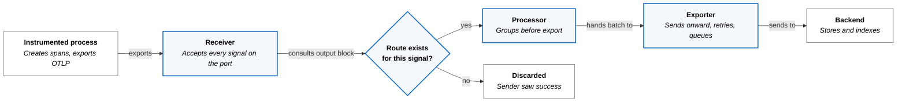
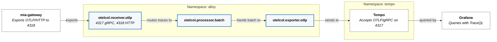

A span is created inside a process and has to end up in a store that something
else queries. Between those two points sit a wire format, a collector, one or
more network boundaries, a batch window, and a buffer. Each of them can lose the
span, and only one of them will tell the sender.

"OpenTelemetry" names four separate things: a specification, a wire protocol
(OTLP), language SDKs that produce data, and the Collector that moves it. This
study covers the protocol and the pipeline. It uses traces as the worked signal,
and the reason that restriction matters turns out to be the most useful thing
here.

## What OTLP Standardizes

OTLP fixes what would otherwise be negotiated between every producer and every
backend.

| Decision | What OTLP specifies |
|---|---|
| Transport | gRPC, or HTTP carrying protobuf or JSON |
| Port | 4317 for gRPC, 4318 for HTTP |
| Path | `/v1/traces`, `/v1/metrics`, `/v1/logs` for OTLP/HTTP |
| Encoding | `application/x-protobuf` or `application/json` |
| Failure semantics | retryable, non-retryable, and partial success |

Those ports and paths are defaults, not guarantees: "Non-default URL paths for
requests MAY be configured on the client and server sides." Naming the port
explicitly in a client configuration is therefore worth the extra line.

Two failure rules are commonly inverted. A retryable error means the client
"SHOULD record the error and may retry," using exponential backoff. **Partial
success is not a failure.** It arrives as HTTP 200 with a populated
`partial_success` field, and "the client MUST NOT retry the request." Part of the
payload was rejected and the rest was accepted, so resending duplicates the
accepted part. A client that treats partial success as an error produces
duplicate spans instead of recovering lost ones.

## A Pipeline Is Components Wired per Signal

The Collector model has three component kinds — receivers, processors, exporters
— and the wiring between them is declared **per signal**, not once per pipeline.
A receiver listening on a port accepts every signal type sent to it. What
happens next depends entirely on whether a route exists for that signal.

In Alloy's configuration language the route is an `output` block:

```alloy
otelcol.receiver.otlp "receiver" {
  grpc { endpoint = "0.0.0.0:4317" }
  http { endpoint = "0.0.0.0:4318" }

  output {
    traces = [otelcol.processor.batch.default.input]
  }
}
```

That block is the entire routing table. A signal absent from it has no
consumers, and the reference states the consequence directly: "by default,
telemetry data is dropped."

The drop happens **after acceptance**. The receiver has already returned a
success response, because the request was well-formed and arrived intact. From
the client's position the export succeeded. Reachability and routing are
independent properties, and a sender can only observe the first.



## Four Ways a Pipeline Loses Data

The hops are distinguishable, which is what makes a missing trace diagnosable
rather than mysterious.

| Loss | Where | Visible to sender |
|---|---|---|
| Connection refused or denied | Network boundary before the receiver | Yes — the export fails |
| No route for the signal | Receiver's `output` block | No — export returned success |
| Retry budget exhausted | Exporter, after backoff | No |
| Buffer lost on restart | Exporter's in-memory queue | No |

Only the first is an error at the sender. The other three are silent there and
visible only in the collector's own telemetry, which is why a collector that does
not export metrics about itself is difficult to operate.

## Batching Is a Three-Term Trade

A batch processor groups records before export, and the settings are usually
described as a latency-versus-throughput trade. There is a third term.

- `send_batch_size` — the count that triggers a flush. Larger means fewer, bigger
  requests.
- `timeout` — how long to wait before flushing an incomplete batch. Longer means
  the same, plus added delay before data is queryable.
- `send_batch_max_size` — the upper bound on a batch. The documented constraint
  is that it "must be greater than or equal to `send_batch_size`," and the value
  `0` means "batches can be any size," removing the bound.

The third term is loss. Whatever is held in an unflushed batch is in memory in
one process, so a batch window is also a statement about how much data is
acceptable to lose when that process dies. Raising the size and the timeout
together increases throughput and increases the amount at risk, and removing the
maximum means a single request to the backend has no size ceiling the collector
will enforce.

A receiver's own request-size limit does not help here. It bounds what arrives at
the collector, not what the collector sends onward.

## Retries and Queues Decide What an Outage Costs

An OTLP exporter typically pairs a retry policy with a queue, and the two answer
different questions.

Retry policy answers *how long to keep trying*. With an elapsed-time budget, the
behavior at the end of it is explicit: "If a batch hasn't been sent
successfully, it's discarded after the time specified by `max_elapsed_time`
elapses." Setting that budget to `0s` retries forever instead, which converts
bounded data loss into unbounded memory growth.

The queue answers *what happens while trying*. The default is an in-memory
buffer; a persistent queue requires a storage component to be configured
explicitly. In-memory means a process restart loses the buffer, and a single
replica means there is no other copy.

So an outage shorter than the retry budget is absorbed, an outage longer than it
loses data, and a collector restart loses data regardless of the budget. None of
those three are reported to the producer.

## `insecure` Is Not `insecure_skip_verify`

Two TLS settings on an exporter have names that suggest a gradient, and they are
not one.

- `insecure` "disables TLS when connecting to the configured server." No TLS
  session is established.
- `insecure_skip_verify` "ignores insecure server TLS certificates." TLS is
  negotiated and the connection is encrypted; only certificate validation is
  skipped.

They are not degrees of the same thing. The first removes the layer; the second
keeps the layer and removes an identity check. Setting both leaves the second
with nothing to act on, which is harmless and misleading — a reader scanning the
configuration sees two mitigating qualifiers where one setting is doing all the
work.

Choosing between them is a question about what the surrounding network already
guarantees, and the honest form of that question names what else restricts who
can open the connection.

---

## How This Platform Implements It

The path is a tenant workload, a collector in its own namespace, and Tempo.



The workload configures transport and nothing else:

```yaml
- name: OTEL_EXPORTER_OTLP_ENDPOINT
  value: "http://alloy-receiver.alloy.svc.cluster.local:4318"
- name: OTEL_EXPORTER_OTLP_PROTOCOL
  value: "http/protobuf"
- name: OTEL_SERVICE_NAME
  value: "mia-gateway"
```

It does not reference Tempo. That indirection is the arrangement's whole value:
the backend can be replaced without touching the workload.

Each hop carries a NetworkPolicy on the receiving side, and each names the
sending pod rather than the namespace alone — the `alloy` policy admits
`app: mia` on 4317 and 4318, and the `tempo` policy admits
`app.kubernetes.io/name: alloy-receiver` on 4317 only. The second policy is what
makes the collector a boundary instead of a convenience, because a workload
cannot skip it by addressing Tempo directly. `OBSERVABILITY_MODEL.md` requires
exactly that — "workloads do not send traces directly to Tempo" — and the policy
is what enforces a sentence that would otherwise be advice.

One asymmetry is worth noting: the Tempo policy opens 4317 only, so a workload
attempting OTLP/HTTP against Tempo fails on the port before it fails on the
policy.

## Where This Platform Diverges

Four discrepancies, in descending order of how much they matter.

**A workload asks for three signals and two are discarded.** The `mia`
configuration sets `traces: true, metrics: true, logs: true`, and the receiver's
`output` block routes `traces` alone. Metrics and logs are accepted on 4318,
answered with success, and dropped. The routing is deliberate —
`OBSERVABILITY_MODEL.md` makes OTLP the trace path and says "OTLP metrics
emitted by a workload may be useful implementation detail, but do not by
themselves satisfy the current Formation `metrics` capability contract," with
metrics arriving by Prometheus scraping and logs by Loki. The divergence is not
the routing. It is that the producer declares three signals, nothing rejects
two of them, and no configuration on either side records that they go nowhere.

**Nine of twelve settings restate the default.**

| Setting | Configured | Default |
|---|---|---|
| `grpc` endpoint | `0.0.0.0:4317` | `0.0.0.0:4317` |
| `http` endpoint | `0.0.0.0:4318` | `0.0.0.0:4318` |
| `include_metadata` | `false` | `false` |
| `max_request_body_size` | `20MiB` | `20MiB` |
| `retry_on_failure` intervals | `5s` / `30s` / `5m` | `5s` / `30s` / `5m` |
| `sending_queue` enabled | `true` | `true` |
| `send_batch_size` | `8192` | `2000` |
| `send_batch_max_size` | `0` | `3000` |
| `timeout` | `2s` | `200ms` |

Only the last three rows are decisions: four times the batch size, ten times the
timeout, and no upper bound. The rest reads as deliberate and is not, which will
mislead whoever changes one of those defaults upstream and cannot tell which
lines were chosen here.

**The retry and queue settings are defaults, so their consequences are
inherited rather than chosen.** Five minutes of failed export discards the
batch; the queue is in memory; the deployment runs one replica. A Tempo outage
under five minutes is absorbed, over five minutes loses data, and an Alloy
restart loses the queue either way.

**Both TLS settings are present on the `alloy`-to-`tempo` exporter.** With
`insecure = true` the hop carries no TLS, so `insecure_skip_verify = true` is
inert. What restricts that port today is the NetworkPolicy above.

## What Has Not Been Verified

The pipeline is declared in Git and the receiver materialized after a
multi-control-plane incident, but that incident record still carries an open
follow-up: "validate tracing end-to-end from `mia` into Tempo now that the
receiver exists." A retired earlier workload was verified along the same path;
the current one has not been.

So the pipeline is proven to exist and not proven to deliver. Three checks would
settle it.

| Claim | How it would be checked |
|---|---|
| Spans from `mia-gateway` reach Tempo | Query Tempo for `service.name = mia-gateway` |
| Metrics and logs are accepted and dropped | Compare the receiver's accepted counts against the exporter's sent counts, per signal |
| The export queue is not saturated | Read the exporter's queue-size metric |

The second and third read Alloy's own metrics endpoint on port 12345, which is
not a read-only `kubectl` verb and needs explicit approval.

## The Choices This Leaves You

**Where a workload terminates.** A workload addressing a collector can be
re-pointed at a different backend without being rebuilt. A workload addressing
the backend cannot. A policy on the backend is what keeps that choice reversible
once someone discovers the shorter path.

**What a batch window is worth.** Latency, throughput, and loss-on-crash move
together. Any batch setting is a position on all three, whether or not it was
chosen as one.

**Which hop to suspect.** A denied connection fails at the sender, a missing
route succeeds and discards, an exhausted retry budget drops after backoff, and a
restart loses the buffer. Three of the four are invisible to the producer, so the
collector's own telemetry is not optional instrumentation — it is the only place
those three are observable.

## References

- [OTLP Specification 1.11.0](https://opentelemetry.io/docs/specs/otlp/)
- [`otelcol.receiver.otlp`](https://grafana.com/docs/alloy/latest/reference/components/otelcol/otelcol.receiver.otlp/)
- [`otelcol.processor.batch`](https://grafana.com/docs/alloy/latest/reference/components/otelcol/otelcol.processor.batch/)
- [`otelcol.exporter.otlp`](https://grafana.com/docs/alloy/latest/reference/components/otelcol/otelcol.exporter.otlp/)
